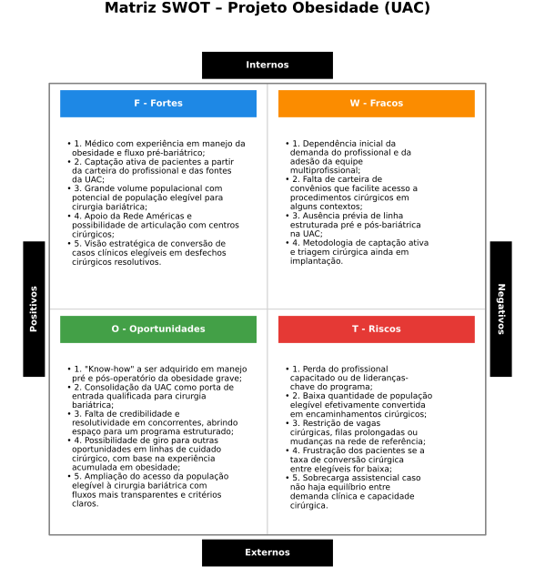
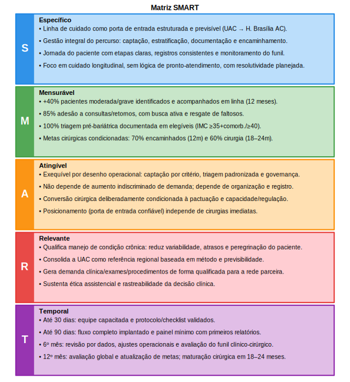
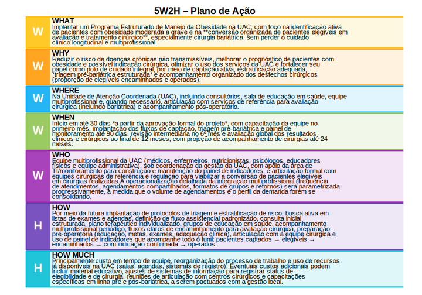
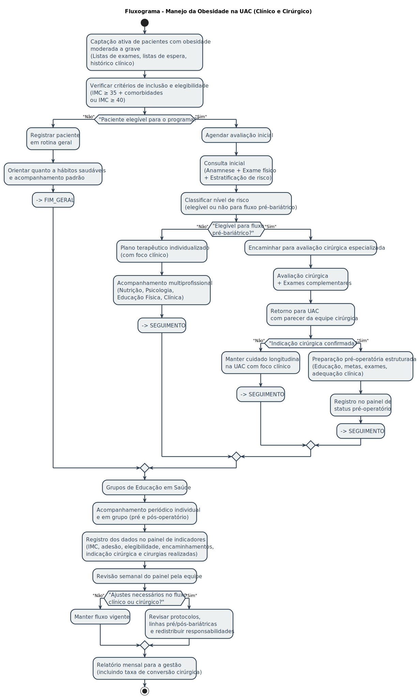
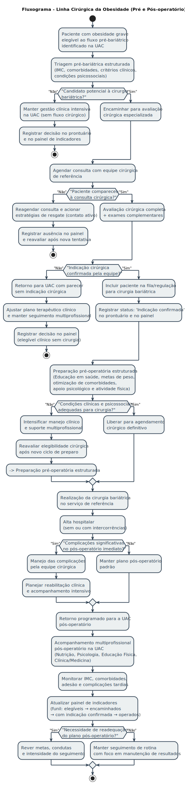
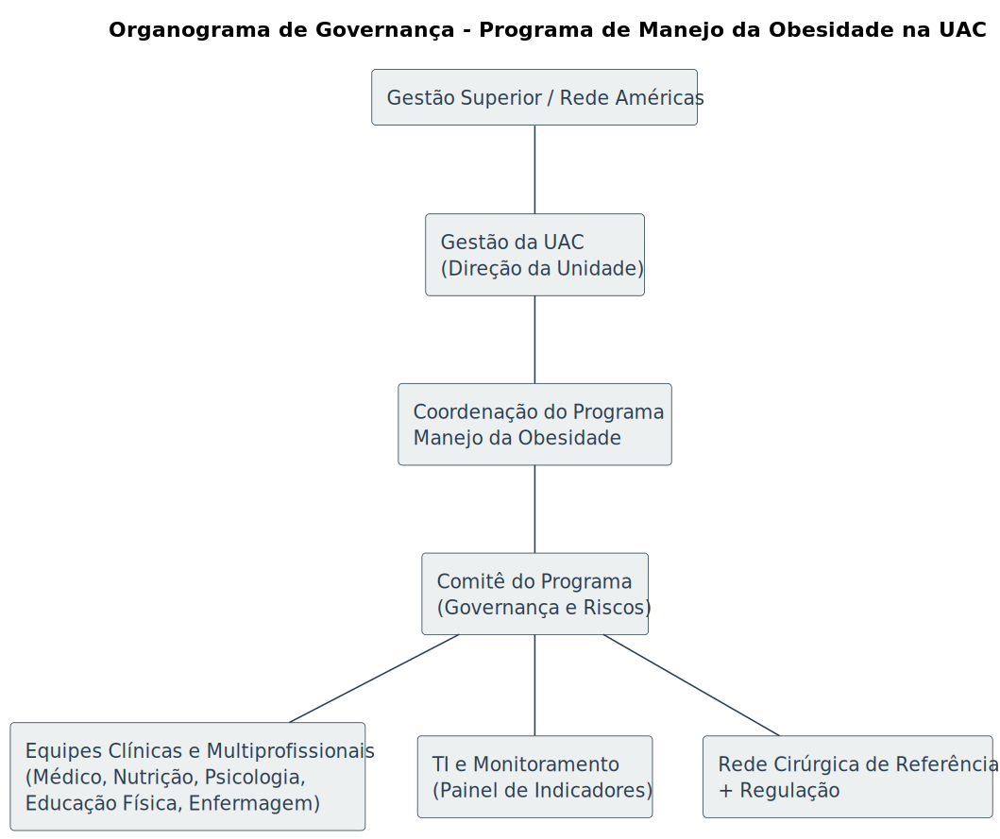
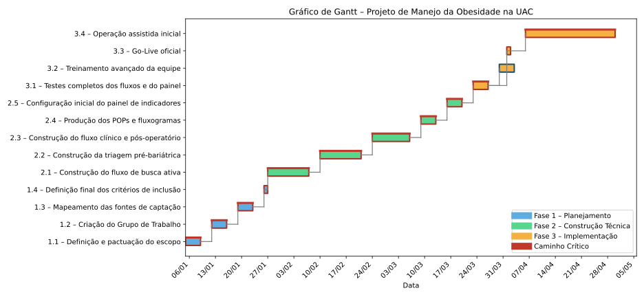

#+OPTIONS: toc:2 num:t H:3 ^:nil
#+STARTUP: overview
#+PROPERTY: header-args:python :exports results

#+LATEX_HEADER: \usepackage{fgv-header}

#+begin_export latex
\begingroup
\linespread{1}\selectfont
\begin{tcolorbox}[title=Ficha Técnica,
  colback=gray!5,colframe=gray!40,boxrule=0.4pt,sharp corners]
\begin{tblr}{rowsep=1pt,stretch=1, rows={t}, colspec={Q[l,2.8cm] X[l]}}
\textbf{Curso}   		& MBA em Gestão da Saúde \\
\textbf{Turma}      		& T-01 \\
\textbf{Pólo}      		& Brasília \\
\textbf{Disciplina}     	& Empreendedorismo em Saúde \\
\textbf{Professor}      	& Marcelo Goldstein \\
\textbf{Trabalho}  	        & Trabalho final \\
\textbf{Aluno(s)}     		& Gustavo M. Mendes de Tarso. \\
\textbf{Prazo}     		& 21 de dezembro de 2025 \\
\textbf{Título do trabalho}     & Desenvolvimento de um Modelo Empreendedor em Saúde para Captação e Conversão Clínico-Cirúrgica da Obesidade na Unidade Avançada de Ceilândia \\ 
\end{tblr}
\end{tcolorbox}
\endgroup
#+end_export

#+LATEX: \FGVNewPage

* Introdução
A obesidade é uma condição de alta prevalência, fortemente associada a doenças crônicas não transmissíveis e responsável por aumento expressivo na demanda assistencial na população mundial. Este projeto visa estruturar um Programa de Manejo da Obesidade com foco em captação ativa, cuidado longitudinal, educação em saúde e, de forma estratégica, na triagem adequada para tratamento cirúrgico (incluindo cirurgia bariátrica) quando indicado, de modo a *converter consultas clínicas em desfechos cirúrgicos resolutivos para os pacientes elegíveis*.

Este documento consolida:

#+ATTR_LATEX: :environment hlevelone
1. Análise estratégica e definição de objetivos  
   - Análise SWOT  
   - Matriz SMART  

2. Planejamento operacional e execução  
   - Plano 5W2H  
   - Estrutura Analítica do Projeto (EAP)  
   - Cronograma  

3. Governança, responsabilidades e riscos  
   - Matriz RACI  
   - Matriz de riscos e estratégias de mitigação  

4. Sustentação do modelo e acompanhamento  
   - Recursos necessários  
   - Plano de Monitoramento e Avaliação  
   - Plano de Comunicação  

5. Implantação e consolidação do programa  
   - Plano de Implementação (Go-Live)

#+LATEX: \FGVNewPage

* Nota Metodológica e Declaração de Confidencialidade
Este trabalho foi concebido, estruturado e desenvolvido integralmente pelo autor, sendo de sua exclusiva responsabilidade a formulação das ideias, o desenho do modelo de negócio, as premissas estratégicas, as análises econômicas e a proposição do plano de implementação aqui apresentados.

O uso da ferramenta ChatGPT (versão 5.2) ocorreu de forma pontual e instrumental, restrito exclusivamente a atividades de organização estrutural do documento, revisão ortográfica, aprimoramento da fluidez sintática da língua portuguesa e apoio na padronização formal do texto, sem qualquer interferência na autoria intelectual, no conteúdo conceitual, nas decisões estratégicas ou nas premissas analíticas do projeto.

Ressalta-se, ainda, que este documento descreve um projeto real de caráter estratégico e empresarial, concebido com a finalidade de implementação prática em ambiente organizacional privado. Em razão disso, seu conteúdo é estritamente confidencial, não devendo ser reproduzido, divulgado, compartilhado ou publicizado, no todo ou em parte, fora do contexto acadêmico específico da Disciplina de Empreendedorismo em Saúde do MBA Executivo em Gestão de Saúde da Fundação Getulio Vargas (FGV), para a qual este trabalho é apresentado exclusivamente com fins avaliativos.

A eventual utilização deste material para quaisquer outros fins, distintos da avaliação acadêmica mencionada, não é autorizada pelo autor.

#+LATEX: \FGVNewPage

* Resumo Executivo
A obesidade grave é hoje uma das principais fontes de demanda assistencial complexa na UAC, associada a altas taxas de doenças crônicas, uso recorrente de exames e consultas pouco resolutivas. A unidade, contudo, ainda não dispõe de uma linha estruturada que integre captação ativa, cuidado clínico longitudinal e triagem organizada para cirurgia bariátrica.

Este projeto propõe implantar um Programa Estruturado de Manejo da Obesidade na UAC, articulando equipe multiprofissional, protocolos de triagem pré-bariátrica e fluxo de encaminhamento cirúrgico pactuado com a rede de referência. A lógica central é transformar consultas clínicas dispersas em um *funil organizado* que identifique precocemente pacientes elegíveis, prepare adequadamente os casos indicados e acompanhe os resultados no pós-operatório.

O propósito estratégico do programa é *converter, de forma segura e documentada, a demanda clínica de pacientes com obesidade grave em desfechos cirúrgicos resolutivos quando houver indicação*, mantendo o cuidado clínico e multiprofissional como base. Para isso, o projeto integra ferramentas de gestão (SWOT, SMART, 5W2H, EAP, RACI, matriz de riscos e cronograma) em um desenho único, coerente e operacionalizável.

A expectativa é que, após a fase de implantação, a UAC se consolide como porta de entrada qualificada para o manejo clínico-cirúrgico da obesidade, com indicadores claros de captação, elegibilidade, encaminhamento, indicação confirmada e realização de cirurgias bariátricas. As metas numéricas de conversão cirúrgica serão calibradas à medida que a capacidade real da rede de referência for pactuada e os primeiros dados assistenciais forem consolidados.

** Principais resultados esperados
#+ATTR_LATEX: :environment hleveltwo
1. Organização da linha de cuidado da obesidade na UAC, com fluxo claro desde a captação ativa até o seguimento pós-operatório.
2. Aumento do número de pacientes com obesidade moderada e grave identificados, estratificados e acompanhados em rotina multiprofissional.
3. Implantação de triagem pré-bariátrica estruturada, com registro padronizado de critérios clínicos, comorbidades e elegibilidade cirúrgica.
4. Ampliação da proporção de pacientes elegíveis encaminhados para avaliação cirúrgica, com monitoramento do funil clínico-cirúrgico (elegíveis → encaminhados → com indicação → operados).
5. Disponibilização de um painel de indicadores que apoie decisões clínicas, cirúrgicas e de gestão (consultas, elegibilidade, fila, tempos de percurso e desfechos).
6. Fortalecimento do papel da UAC como polo de cuidado integral em obesidade e como porta de entrada qualificada para a cirurgia bariátrica na rede de referência.

#+LATEX: \FGVNewPage

* Descrição do Negócio
** Visão e Missão
A visão do empreendimento é consolidar a Unidade Avançada de Ceilândia como uma *plataforma regional de referência na gestão estruturada do cuidado clínico-cirúrgico da obesidade*, reconhecida pela previsibilidade do percurso assistencial, pela qualidade das decisões clínicas e pela capacidade de gerar valor assistencial, institucional e econômico de forma ética e sustentável.

A missão do negócio é *organizar, qualificar e conduzir o percurso assistencial de pacientes com obesidade*, desde a captação ambulatorial até o acompanhamento longitudinal e o encaminhamento cirúrgico quando indicado, atuando como porta de entrada estruturada para a rede do Hospital Brasília Águas Claras, com foco em clareza de jornada, rastreabilidade clínica e eficiência operacional.

** Produto ou Serviço
O produto ofertado consiste em um *serviço de gestão integral do funil clínico-cirúrgico da obesidade*, operado no âmbito ambulatorial da Unidade Avançada de Ceilândia. Trata-se de uma linha de cuidado estruturada que integra avaliação clínica, acompanhamento multiprofissional (clínica, nutrição e psicologia), estratificação de risco, preparo pré-operatório e encaminhamento qualificado para avaliação cirúrgica, quando indicado.

A principal inovação do serviço não reside em tecnologia proprietária, mas na *organização do cuidado como produto em si*: protocolos claros, critérios objetivos de elegibilidade, documentação padronizada do percurso e acompanhamento ativo do paciente. Essa abordagem reduz fragmentação, evita peregrinação assistencial e transforma consultas isoladas em uma jornada assistencial previsível e governável.

** Proposta de Valor

A proposta de valor do negócio está na oferta de uma *porta de entrada estruturada e confiável* para o cuidado da obesidade, capaz de atender simultaneamente às necessidades dos pacientes, da instituição e da rede cirúrgica de referência.

Para o paciente, o valor está na clareza da jornada, no acesso coordenado a múltiplas especialidades, na transparência quanto aos critérios clínicos e nas expectativas realistas em relação ao tratamento cirúrgico. Para a instituição, o modelo gera *demanda qualificada e previsível* de consultas, exames e procedimentos, com melhor uso da capacidade instalada e redução de ineficiências operacionais. Para a rede cirúrgica do Hospital Brasília Águas Claras, o serviço funciona como um filtro ético e técnico, entregando pacientes melhor preparados, com indicação documentada e menor risco de frustração ou retrabalho.

Dessa forma, o negócio se diferencia não pelo volume bruto de atendimentos, mas pela *qualidade do funil assistencial*, pela governança do percurso clínico-cirúrgico e pela capacidade de transformar complexidade assistencial em valor estruturado.

#+LATEX: \FGVNewPage

* Análise de Mercado
** Análise do Setor
O setor de saúde suplementar e privada no Brasil apresenta tendência consistente de crescimento na demanda por serviços relacionados ao manejo da obesidade, impulsionada pelo aumento da prevalência de doenças crônicas não transmissíveis, pelo envelhecimento da população e pela maior conscientização sobre os riscos clínicos associados ao excesso de peso. Observa-se, adicionalmente, uma expansão do interesse por soluções assistenciais que ofereçam cuidado coordenado, previsível e multiprofissional, em contraposição a atendimentos fragmentados e episódicos.

No contexto urbano do Distrito Federal, essas tendências se expressam de forma particularmente relevante em regiões de alta densidade populacional, como Ceilândia, onde há grande contingente de pacientes com obesidade moderada a grave, demanda reprimida por cuidado especializado e baixa oferta de modelos estruturados de acompanhamento longitudinal. Paralelamente, a cirurgia bariátrica mantém-se como intervenção consolidada e crescente, tanto no âmbito particular quanto por meio de convênios, desde que precedida por triagem adequada e preparo clínico consistente.

** Público-Alvo
O público-alvo do negócio é composto predominantemente por *adultos com obesidade moderada a grave*, residentes em Ceilândia e regiões adjacentes, com acesso a serviços de saúde privados ou por convênios, e que apresentam necessidade de acompanhamento clínico estruturado, avaliação multiprofissional e eventual indicação cirúrgica.

Trata-se de um público heterogêneo do ponto de vista socioeconômico, mas homogêneo quanto à necessidade de clareza de jornada, orientação técnica e acesso organizado aos serviços de saúde. Uma parcela relevante desses pacientes já utiliza o sistema de saúde de forma recorrente, realizando exames e consultas isoladas, porém sem integração assistencial, o que reforça a atratividade de uma proposta que organize o percurso clínico-cirúrgico de forma transparente e contínua.

** Análise da Concorrência
No mercado regional, destaca-se como concorrente direto o Hospital Anchieta, que apresenta como diferencial competitivo a oferta integrada de ambulatório, pronto-socorro estruturado e leitos de internação, possibilitando captação ampla de pacientes por múltiplas portas de entrada. Essa configuração confere ao concorrente vantagem em termos de volume e imediatismo assistencial.

O posicionamento da Unidade Avançada de Ceilândia, por sua vez, não busca competir diretamente com a lógica de pronto-atendimento, mas sim *diferenciar-se pela organização do cuidado*. O negócio se posiciona como uma alternativa focada em triagem ética, acompanhamento longitudinal e gestão estruturada do funil clínico-cirúrgico da obesidade, priorizando previsibilidade, documentação e qualidade da decisão clínica. Estratégias assistenciais de baixo custo, como ações pontuais de captação orientada e agendas programadas, complementam esse posicionamento e mitigam a ausência de um pronto-socorro como porta de entrada.

#+LATEX: \RedeNewPage

* Caracterização do Modelo de Negócio
O presente empreendimento configura-se como um modelo estruturado de gestão integral do funil clínico-cirúrgico da obesidade, concebido para operar de forma sustentável, escalável e financeiramente rentável, a partir da integração entre captação ambulatorial qualificada, acompanhamento multiprofissional longitudinal e conversão ética em procedimentos diagnósticos e cirúrgicos de alta complexidade.

O negócio tem como ponto de entrada o Ambulatório da Unidade Avançada de Ceilândia (UAC), que atua como posto avançado do Hospital Brasília Águas Claras, explorando de forma estratégica o elevado contingente populacional da Região Administrativa de Ceilândia — a maior do Distrito Federal — como vetor de volumetria assistencial. Os pacientes acessam o ambulatório tanto por atendimento particular, com valor médio de R$ 120,00 por consulta, quanto por meio de planos de saúde, com repasse médio estimado em R$ 80,00 por consulta.

A proposta central do modelo reside na organização e gestão ativa do fluxo de pacientes com obesidade, desde a primeira consulta clínica até o desfecho terapêutico mais adequado, incluindo, quando indicado de forma estritamente ética e técnica, a cirurgia bariátrica. O produto ofertado não se limita a consultas isoladas, mas sim a um serviço integrado, que compreende o acompanhamento coordenado do paciente por médicos clínicos, nutricionistas, psicólogos, cirurgião bariátrico e demais especialidades correlatas, bem como a realização de exames diagnósticos (SADT) necessários à adequada condução clínica.

Do ponto de vista econômico, o modelo de negócio não se baseia em remuneração por indicação ou qualquer forma de incentivo financeiro vinculado à decisão médica individual, respeitando integralmente os preceitos éticos e regulatórios da prática em saúde. A geração de receita decorre exclusivamente da volumetria assistencial qualificada, isto é, do aumento sustentado do número de consultas, exames e procedimentos realizados dentro do ecossistema do Hospital Brasília Águas Claras, seja por pagamento direto do paciente particular, seja por repasses dos convênios.

No caso específico das cirurgias bariátricas, considera-se um valor médio de referência de R$ 50.000,00 por procedimento em regime particular. Para pacientes conveniados, o hospital opera com repasses significativamente superiores ao custo direto, variando entre 100% e 500% sobre o valor base, conforme o contrato e o convênio, o que confere elevada atratividade financeira ao modelo quando analisado em escala.

Dessa forma, a Unidade Avançada de Ceilândia atua como núcleo de captação, triagem clínica e preparo, enquanto o Hospital Brasília Águas Claras concentra a execução dos procedimentos, exames e cirurgias, apropriando-se da totalidade das receitas assistenciais geradas. O modelo prescinde, neste estágio inicial, de estruturas híbridas de monetização ou receitas paralelas, concentrando-se exclusivamente na maximização eficiente e ética do fluxo assistencial.

Sob a ótica estratégica, trata-se de um modelo replicável, passível de implementação em outras regiões administrativas do Distrito Federal e, posteriormente, em diferentes mercados regionais do país, desde que observadas as premissas de alta densidade populacional, demanda reprimida por cuidado especializado em obesidade e integração com rede hospitalar de referência.

A governança do negócio está sob responsabilidade do Coordenador da Unidade Avançada de Ceilândia, que atua como idealizador e gestor do modelo, garantindo alinhamento entre objetivos assistenciais, eficiência operacional, sustentabilidade financeira e conformidade regulatória. A estrutura foi concebida para execução imediata, com potencial concreto de atração de parceiros estratégicos ou investidores, especialmente diante da previsibilidade de demanda, do alto valor agregado dos procedimentos e da possibilidade de ganho de escala.

** Dimensionamento de Mercado – TAM, SAM e SOM
O dimensionamento de mercado deste empreendimento parte de uma lógica distinta dos modelos tradicionais de consultoria ou serviços assistenciais isolados. Trata-se de um modelo de captura de valor baseado em volumetria assistencial qualificada, no qual a geração de receita decorre da organização eficiente do fluxo clínico-cirúrgico da obesidade dentro de um ecossistema hospitalar integrado. Dessa forma, o mercado potencial não é medido apenas pelo número de pacientes elegíveis, mas sobretudo pelo valor econômico associado às consultas, exames e procedimentos efetivamente realizados.

O TAM (Total Addressable Market) corresponde ao universo total de pacientes adultos com obesidade residentes em regiões de alta densidade populacional e com acesso potencial a serviços privados de saúde, seja por pagamento direto ou por meio de planos de saúde. Considerando dados epidemiológicos amplamente consolidados, estima-se que aproximadamente 25% da população adulta apresente obesidade. Aplicando essa proporção à população da Região Administrativa de Ceilândia, que supera 430 mil habitantes, obtém-se um contingente aproximado de 100 a 110 mil potenciais pacientes com obesidade. Ainda que apenas uma fração desse grupo busque atendimento privado, o volume absoluto revela um mercado estruturalmente robusto e permanente.

Do ponto de vista econômico, cada paciente que ingressa no funil assistencial gera valor não apenas na consulta inicial — estimada em R$ 120,00 no atendimento particular ou cerca de R$ 80,00 via convênio — mas também em consultas subsequentes multiprofissionais, exames diagnósticos (SADT) e, em uma parcela dos casos, procedimentos cirúrgicos de alto valor agregado, como a cirurgia bariátrica. Assim, o TAM econômico deve ser compreendido como o potencial máximo de geração de receita assistencial caso o modelo fosse capaz de absorver, ainda que gradualmente, toda a demanda privada latente relacionada ao manejo da obesidade na região.

O SAM (Serviceable Addressable Market) representa a parcela desse mercado que é efetivamente alcançável pelo empreendimento nas condições reais de operação. Nesse recorte, considera-se a capacidade instalada da Unidade Avançada de Ceilândia, sua integração operacional com o Hospital Brasília Águas Claras e os limites práticos de captação, atendimento e acompanhamento longitudinal. O SAM corresponde, portanto, aos pacientes que de fato procuram o ambulatório da UAC — seja de forma espontânea, seja por estratégias estruturadas de captação — e que ingressam no fluxo organizado de manejo da obesidade. Esse mercado é naturalmente menor que o TAM populacional, mas altamente qualificado, pois concentra indivíduos já dispostos a consumir serviços de saúde no setor privado ou suplementar.

Dentro desse universo, cada paciente atendido passa a integrar um funil assistencial que, ao longo do tempo, tende a gerar múltiplos pontos de receita: consultas médicas e multiprofissionais recorrentes, exames complementares e, quando indicado de forma ética e técnica, a cirurgia bariátrica. A atratividade do SAM decorre exatamente dessa característica longitudinal, que transforma um atendimento pontual em uma trajetória assistencial de alto valor econômico acumulado.

Por fim, o SOM (Serviceable Obtainable Market) corresponde à fatia do SAM que o empreendimento consegue efetivamente capturar em sua fase inicial de operação. Trata-se de uma estimativa conservadora, que considera taxas realistas de adesão, capacidade operacional da equipe, maturidade do modelo e dinâmica concorrencial. Mesmo uma penetração relativamente modesta — da ordem de poucos pontos percentuais do mercado atendível — é suficiente para sustentar economicamente o negócio, dada a combinação entre alta volumetria de consultas e o impacto financeiro significativo das cirurgias bariátricas e dos exames associados.

Nesse contexto, o SOM não deve ser interpretado apenas como número absoluto de pacientes, mas como a massa crítica mínima necessária para viabilizar o modelo, garantir fluxo de caixa positivo e criar as condições para expansão futura. À medida que o processo se consolida, os protocolos se refinam e a reputação institucional se fortalece, a tendência é de crescimento progressivo do SOM, seja por aumento da captação local, seja pela replicação do modelo em outras regiões administrativas ou mercados regionais com características semelhantes.

Em síntese, o TAM revela a profundidade estrutural da demanda por manejo da obesidade, o SAM traduz a capacidade real de atendimento e monetização dentro do ecossistema UAC–Hospital Brasília Águas Claras, e o SOM expressa a viabilidade prática e financeira do empreendimento em seu estágio inicial, formando uma base sólida para decisões estratégicas, projeções financeiras e eventual atração de parceiros ou investidores.

#+NAME: tab:tam_sam_som_resumido
#+CAPTION: TAM, SAM e SOM – visão sintética do mercado econômico
#+ATTR_LATEX: :center nil :float nil
#+LATEX: \begin{table}[htbp]
#+LATEX: \centering
#+LATEX: \scriptsize
#+LATEX: \setlength{\tabcolsep}{2pt}
#+LATEX: \begin{tabularx}{\textwidth}{%
#+LATEX:   >{\centering\arraybackslash}m{0.10\textwidth}
#+LATEX:   >{\raggedright\arraybackslash}X
#+LATEX:   >{\raggedright\arraybackslash}X}
#+LATEX: \toprule
#+LATEX: Dimensão & Definição resumida & Base de referência \\
#+LATEX: \midrule
#+LATEX: TAM & Mercado total de pacientes com obesidade com potencial de acesso privado & \textasciitilde{}100.000 a 110.000 adultos com obesidade em Ceilândia \\
#+LATEX: SAM & Pacientes efetivamente alcançáveis pelo ambulatório da UAC & Demanda real captada via consultas particulares e convênios \\
#+LATEX: SOM & Parcela do SAM capturada na fase inicial do modelo & Fração conservadora suficiente para viabilidade econômica \\
#+LATEX: \bottomrule
#+LATEX: \end{tabularx}
#+LATEX: \normalsize
#+LATEX: \end{table}

#+LATEX: \FGVNewPage

* Análise de Contexto
** Análise SWOT – Manejo da Obesidade na UAC
*** F Fortes
#+ATTR_LATEX: :environment hlevelthree
1. Médico com experiência em manejo da obesidade e fluxo pré-bariátrico;
2. Captação ativa de pacientes a partir da carteira do profissional e das fontes da UAC;
3. Grande volume populacional com potencial de população elegível para cirurgia bariátrica;
4. Apoio da Rede Américas e possibilidade de articulação com centros cirúrgicos;
5. Visão estratégica de conversão de casos clínicos elegíveis em desfechos cirúrgicos resolutivos.
*** W Fracos
#+ATTR_LATEX: :environment hlevelthree  
1. Dependência inicial da demanda do profissional e da adesão da equipe multiprofissional;
2. Falta de carteira de convênios que facilite acesso a procedimentos cirúrgicos em alguns contextos;
3. Ausência prévia de linha estruturada pré e pós-bariátrica na UAC;
4. Metodologia de captação ativa e triagem cirúrgica ainda em implantação.
*** O Oportunidades
#+ATTR_LATEX: :environment hlevelthree
1. "Know-how" a ser adquirido em manejo pré e pós-operatório da obesidade grave;
2. Consolidação da UAC como porta de entrada qualificada para cirurgia bariátrica;
3. Falta de credibilidade e resolutividade em concorrentes, abrindo espaço para um programa estruturado;
4. Possibilidade de giro para outras oportunidades em linhas de cuidado cirúrgico, com base na experiência acumulada em obesidade;
5. Ampliação do acesso da população elegível à cirurgia bariátrica com fluxos mais transparentes e critérios claros.
*** T Riscos
#+ATTR_LATEX: :environment hlevelthree
1. Perda do profissional capacitado ou de lideranças-chave do programa;
2. Baixa quantidade de população elegível efetivamente convertida em encaminhamentos cirúrgicos;
3. Restrição de vagas cirúrgicas, filas prolongadas ou mudanças na rede de referência;
4. Frustração dos pacientes se a taxa de conversão cirúrgica entre elegíveis for baixa;
5. Sobrecarga assistencial caso não haja equilíbrio entre demanda clínica e capacidade cirúrgica.

#+ATTR_LATEX: :float nil :center t :width 0.95\textwidth
#+NAME: fig:swot

#+begin_src python :results silent :var org_text=(buffer-substring-no-properties (point-min) (point-max))
import matplotlib
matplotlib.use("Agg")

import matplotlib.pyplot as plt
from matplotlib.patches import Rectangle
import textwrap

plt.rcParams['font.family'] = 'DejaVu Sans'

# -------------------------------------------------------
# Parser: lê headings F/W/O/T e bullets do TEXTO Org
# (não abre arquivo, usa o conteúdo do buffer)
# -------------------------------------------------------
def parse_swot_from_text(text):
    """
    Espera headings tipo (qualquer nível):
      * F Fortes
      ** W Fracos
      *** O Oportunidades
      etc.

    E bullets assim:
      - Item 1
      - Item 2

    Ignora blocos #+begin_src ... #+end_src,
    ignora #+RESULTS: e ignora links [[...]] (como [[file:...]]).

    Retorna dict:
      {
        "F": {"title": "Fortes", "bullets": [...]},
        "W": {...},
        "O": {...},
        "T": {...}
      }
    """
    swot = {}
    current_key = None
    current_title = ""
    current_bullets = []
    in_src_block = False

    def flush():
        nonlocal current_key, current_title, current_bullets
        if current_key is not None:
            swot[current_key] = {
                "title": current_title.strip() or current_key,
                "bullets": current_bullets[:],
            }
        current_key = None
        current_title = ""
        current_bullets = []

    for line in text.splitlines():
        raw = line.rstrip("\n")
        stripped = raw.strip()

        # Blocos de código
        if stripped.lower().startswith("#+begin_src"):
            in_src_block = True
            continue
        if stripped.lower().startswith("#+end_src"):
            in_src_block = False
            continue
        if in_src_block:
            continue

        # Resultados de blocos (não queremos isso como conteúdo da matriz)
        if stripped.upper().startswith("#+RESULTS"):
            continue

        # Qualquer heading que comece com *
        if stripped.startswith("*"):
            flush()
            tmp = stripped.lstrip("*").strip()
            if not tmp:
                continue

            parts = tmp.split(maxsplit=1)
            key = parts[0].upper()          # F, W, O, T... ou outra coisa
            rest = parts[1] if len(parts) > 1 else ""

            if key in ["F", "W", "O", "T"]:
                current_key = key
                current_title = rest
                current_bullets = []
            else:
                current_key = None
            continue

        # Dentro de um dos blocos F/W/O/T
        if current_key is not None:
            # ignora linhas vazias ou comentários
            if not stripped or stripped.startswith("#"):
                continue

            # ignora links do Org, especialmente [[file:...]]
            if stripped.startswith("[[") and stripped.endswith("]]"):
                continue

            if stripped.startswith("- "):
                text_line = stripped[2:].strip()
            else:
                text_line = stripped

            if text_line:
                current_bullets.append(text_line)

    flush()
    return swot

def format_bullets(lines, width):
    """
    Quebra cada item de `lines` em várias linhas se necessário,
    mantendo o ponto '• ' apenas na primeira linha.
    """
    if not lines:
        return ""
    wrapped_lines = []
    for line in lines:
        parts = textwrap.wrap(line, width=width)
        if not parts:
            continue
        for i, part in enumerate(parts):
            prefix = "• " if i == 0 else "  "
            wrapped_lines.append(prefix + part)
    return "\n".join(wrapped_lines)

# -------------------------------------------------------
# Lê o Org (texto) e monta os bullets da SWOT
# -------------------------------------------------------
swot = parse_swot_from_text(org_text)

def get_title(key, default):
    info = swot.get(key)
    if info and info.get("title"):
        return info["title"]
    return default

def get_bullets(key):
    info = swot.get(key)
    if info:
        return info.get("bullets", [])
    return []

# Títulos vindos do Org (F - Fortes etc.)
title_F = get_title("F", "Fortes")
title_W = get_title("W", "Fracos")
title_O = get_title("O", "Oportunidades")
title_T = get_title("T", "Riscos")

bullets_fortes        = get_bullets("F")
bullets_fracos        = get_bullets("W")
bullets_oportunidades = get_bullets("O")
bullets_riscos        = get_bullets("T")

# -------------------------------------------------------
# Layout SWOT
# -------------------------------------------------------
fig, ax = plt.subplots(figsize=(10, 7), dpi=300)

# Limites "lógicos" do desenho (mantidos fixos)
ax.set_xlim(-0.22, 2.22)
ax.set_ylim(-0.18, 2.32)
ax.axis('off')

cor_fortes        = "#1E88E5"
cor_fracos        = "#FB8C00"
cor_oportunidades = "#43A047"
cor_riscos        = "#E53935"

# Quadrantes (2 x 2)
ax.add_patch(Rectangle((0, 1), 1, 1, facecolor="white", edgecolor="lightgray"))
ax.add_patch(Rectangle((1, 1), 1, 1, facecolor="white", edgecolor="lightgray"))
ax.add_patch(Rectangle((0, 0), 1, 1, facecolor="white", edgecolor="lightgray"))
ax.add_patch(Rectangle((1, 0), 1, 1, facecolor="white", edgecolor="lightgray"))

# Moldura geral
ax.add_patch(Rectangle((0, 0), 2, 2, fill=False, edgecolor="gray", linewidth=1.5))

ax.text(1, 2.30, "Matriz SWOT – Projeto Obesidade (UAC)",
        ha="center", va="bottom", fontsize=16, fontweight="bold")

# ======================
# Faixas pretas
# ======================
ax.add_patch(Rectangle((0.7, 2.02), 0.6, 0.12, facecolor="black"))
ax.text(1.0, 2.08, "Internos", ha="center", va="center",
        fontsize=10, fontweight="bold", color="white")

ax.add_patch(Rectangle((0.7, -0.14), 0.6, 0.12, facecolor="black"))
ax.text(1.0, -0.08, "Externos", ha="center", va="center",
        fontsize=10, fontweight="bold", color="white")

offset = 0.07

ax.add_patch(Rectangle((-0.12, 0.70), 0.10, 0.60, facecolor="black"))
ax.text(-offset, 1.00, "Positivos", ha="center", va="center",
        fontsize=10, fontweight="bold", color="white", rotation=90)

ax.add_patch(Rectangle((2.02, 0.70), 0.10, 0.60, facecolor="black"))
ax.text(2 + offset, 1.00, "Negativos", ha="center", va="center",
        fontsize=10, fontweight="bold", color="white", rotation=-90)

# ======================
# Headers coloridos
# ======================
def header(x0, y0, largura, texto, cor):
    ax.add_patch(Rectangle((x0, y0), largura, 0.12,
                           facecolor=cor, edgecolor="none"))
    ax.text(x0 + largura/2, y0 + 0.06, texto,
            ha="center", va="center", fontsize=10,
            fontweight="bold", color="white")

header(0.05, 1.85, 0.9, f"F - {title_F}", cor_fortes)
header(1.05, 1.85, 0.9, f"W - {title_W}", cor_fracos)
header(0.05, 0.85, 0.9, f"O - {title_O}", cor_oportunidades)
header(1.05, 0.85, 0.9, f"T - {title_T}", cor_riscos)

# ======================
# Textos com quebra automática
# ======================
texto_fortes        = format_bullets(bullets_fortes,        width=40)
texto_fracos        = format_bullets(bullets_fracos,        width=32)
texto_oportunidades = format_bullets(bullets_oportunidades, width=40)
texto_riscos        = format_bullets(bullets_riscos,        width=32)

def texto_quadrante(x, y, texto):
    ax.text(
        x, y, texto,
        ha="left", va="top",
        fontsize=9,
        linespacing=1.15,
    )

texto_quadrante(0.08, 1.75, texto_fortes)
texto_quadrante(1.08, 1.75, texto_fracos)
texto_quadrante(0.08, 0.75, texto_oportunidades)
texto_quadrante(1.08, 0.75, texto_riscos)

# ======================
# AJUSTE DINÂMICO DE TAMANHO (ALTURA + LARGURA)
# baseado na quantidade de linhas e no comprimento das linhas
# ======================
lines_f = texto_fortes.splitlines()        if texto_fortes        else []
lines_w = texto_fracos.splitlines()        if texto_fracos        else []
lines_o = texto_oportunidades.splitlines() if texto_oportunidades else []
lines_t = texto_riscos.splitlines()        if texto_riscos        else []

all_lines = lines_f + lines_w + lines_o + lines_t

max_lines_section = max(
    len(lines_f),
    len(lines_w),
    len(lines_o),
    len(lines_t),
    1
)

max_line_len = max((len(l) for l in all_lines), default=1)

# baseline: 10 linhas por quadrante e ~40 caracteres por linha
base_width_in  = 10.0
base_height_in = 7.0

scale_h = max(1.0, max_lines_section / 10.0)
scale_w = max(1.0, max_line_len      / 40.0)

fig.set_size_inches(base_width_in * scale_w,
                    base_height_in * scale_h)

# ======================
# Salvar figura
# ======================
fig.savefig(
    "swot_obesidade.svg",
    bbox_inches="tight",
    pad_inches=0.02,
    format="svg"
)
plt.close(fig)
#+end_src

* Propósito Estratégico do Programa
Embora o Programa de Manejo da Obesidade na UAC contemple ações contínuas de educação em saúde, cuidado clínico e acompanhamento multiprofissional, seu propósito estratégico central é *identificar precocemente pacientes com obesidade grave que preencham critérios para avaliação cirúrgica*, garantindo *triagem estruturada, documentação completa e encaminhamento qualificado* para serviços especializados.

O programa busca, portanto, **converter a demanda clínica em resolutividade cirúrgica quando houver indicação**, fortalecendo o papel da UAC como porta de entrada qualificada para o cuidado pré e pós-operatório. Isso inclui:
#+ATTR_LATEX: environment hlevelone
1. Captação ativa dirigida para casos com IMC \geqslant{} 35 + comorbidades ou IMC \geqslant{} 40;  
2. Registro padronizado dos critérios técnicos, exames e histórico clínico;  
3. Preparação adequada do paciente antes da avaliação cirúrgica;  
4. Acompanhamento longitudinal após parecer da equipe cirúrgica;  
5. Monitoramento da taxa de “casos elegíveis → casos encaminhados → casos operados”;  
6. Redução da variabilidade no acesso ao cuidado cirúrgico;  
7. Integração entre equipe multiprofissional e equipe cirúrgica de referência.

Com isso, a UAC deixa de atuar apenas como ponto de cuidado clínico e passa a exercer papel de *estratificação, qualificação e direcionamento cirúrgico*, garantindo maior resolutividade assistencial e impacto direto na saúde da população com obesidade mórbida.

A implementação dos fluxos, protocolos e rotinas descritos ao longo deste documento está condicionada à aprovação formal do projeto pela gestão da unidade e pela rede de referência, bem como à pactuação posterior da capacidade cirúrgica efetivamente disponível.

#+LATEX: \FGVNewPage
* DRE projetado
O Demonstrativo de Resultados do Exercício (DRE) projetado a seguir apresenta uma visão simplificada da geração de receita do Programa de Manejo da Obesidade, considerando exclusivamente as entradas financeiras decorrentes das consultas, exames (SADT) e procedimentos cirúrgicos efetivamente realizados no ecossistema Hospital Brasília Águas Claras, a partir da captação inicial realizada pela Unidade Avançada de Ceilândia (UAC).

Trata-se de uma projeção conservadora, baseada em volumetria factível, sem adoção de modelos híbridos ou remuneração por indicação, respeitando integralmente os princípios éticos e assistenciais. O racional econômico do modelo está ancorado na gestão integral do funil clínico-cirúrgico, em que a UAC atua como porta de entrada qualificada, organizando a demanda e elevando a taxa de conversão de consultas em exames e cirurgias quando houver indicação médica.

Para fins de projeção, considerou-se um cenário inicial com predominância de atendimentos ambulatoriais, progressiva geração de exames complementares e uma taxa conservadora de conversão cirúrgica entre os pacientes elegíveis. Os valores apresentados não incluem receitas estéticas ou procedimentos não relacionados ao manejo clínico-cirúrgico da obesidade.

#+NAME: tab:dre_projetado_obesidade
#+CAPTION: DRE Projetado Simplificado – Programa de Manejo da Obesidade (12 meses)
#+ATTR_LATEX: :center nil :float nil
#+LATEX: \begin{table}[htbp]
#+LATEX: \centering
#+LATEX: \scriptsize
#+LATEX: \setlength{\tabcolsep}{2pt}
#+LATEX: \begin{tabularx}{\textwidth}{%
#+LATEX:   >{\raggedright\arraybackslash}m{0.26\textwidth}
#+LATEX:   >{\raggedright\arraybackslash}X
#+LATEX:   >{\raggedleft\arraybackslash}m{0.18\textwidth}}
#+LATEX: \toprule
#+LATEX: Conta & Premissa básica & Valor anual estimado (R\$) \\
#+LATEX: \midrule
#+LATEX: Receita com consultas & Consultas particulares (R\$120) e convênios (média R\$80) & 2.400.000 \\
#+LATEX: Receita com exames (SADT) & Exames gerados a partir das consultas clínicas & 1.800.000 \\
#+LATEX: Receita com cirurgias bariátricas & Cirurgias particulares e convênios (valor médio ponderado) & 7.500.000 \\
#+LATEX: \midrule
#+LATEX: Receita Bruta Total &  & 11.700.000 \\
#+LATEX: \midrule
#+LATEX: Custos operacionais assistenciais & Equipe, insumos, apoio assistencial (estimativa conservadora) & (4.200.000) \\
#+LATEX: Custos administrativos e operacionais & Estrutura, gestão, TI, suporte & (1.300.000) \\
#+LATEX: \midrule
#+LATEX: Resultado Operacional Estimado &  & 6.200.000 \\
#+LATEX: \bottomrule
#+LATEX: \end{tabularx}
#+LATEX: \normalsize
#+LATEX: \end{table}

** Nota metodológica sobre a utilização de instrumentos financeiros
Embora existam ferramentas padronizadas para projeção financeira detalhada, como planilhas de planejamento econômico-operacional, optou-se por não realizar o preenchimento integral desses instrumentos neste momento.

Essa decisão decorre do estágio atual do modelo de negócio, que se encontra em fase de concepção estratégica e desenho institucional, sem que estejam ainda pactuados de forma definitiva elementos críticos como mix de pacientes (particular vs. convênios), volumes mensais consolidados, capacidade cirúrgica efetiva da rede de referência, política de repasses, alocação definitiva de custos compartilhados e estrutura final de equipes dedicadas.

A utilização de projeções excessivamente detalhadas neste estágio poderia induzir a uma falsa sensação de precisão, sem lastro empírico suficiente, o que não é desejável do ponto de vista de governança e planejamento responsável em saúde.

Assim, o presente trabalho adota como abordagem principal a análise econômica estruturada por meio de um Demonstrativo de Resultados projetado em nível macro, suficiente para demonstrar a viabilidade financeira, a lógica de geração de valor do funil clínico-cirúrgico e a sustentabilidade do modelo, deixando o refinamento quantitativo detalhado para a fase de implantação e operação assistida do programa.

#+LATEX: \FGVNewPage

* Custos e Impacto Econômico do Programa
O Programa de Manejo da Obesidade foi estruturado para operar com baixo custo incremental, aproveitando de forma intensiva a infraestrutura física, os equipamentos e os processos já existentes na Unidade Avançada de Ceilândia (UAC). Não há necessidade de investimentos adicionais em salas, mobiliário ou equipamentos antropométricos, o que reduz significativamente a barreira de entrada e o risco financeiro do projeto.

Os principais custos adicionais concentram-se na ampliação da equipe multiprofissional, especificamente com a contratação de nutricionista e psicóloga em regime CLT. Esses profissionais, entretanto, não serão dedicados exclusivamente ao programa de obesidade, atuando de forma compartilhada com outras linhas assistenciais da UAC. Esse desenho permite diluição dos custos fixos, aumento de eficiência operacional e maior sustentabilidade econômica do modelo.

Do ponto de vista assistencial, a presença estruturada da nutrição e da psicologia é considerada componente crítico do programa, pois impacta diretamente a adesão dos pacientes, a qualidade da triagem pré-bariátrica, a segurança clínica e a redução de riscos no pré e pós-operatório. Sob a ótica econômica, trata-se de um custo estruturante que viabiliza maior taxa de conversão qualificada no funil clínico-cirúrgico.

É importante destacar que os custos relacionados aos procedimentos cirúrgicos não integram o custo do programa da UAC, uma vez que o modelo de negócio tem como finalidade a captação, organização e qualificação da demanda assistencial. A realização das cirurgias e seus respectivos custos pertencem exclusivamente ao Hospital Brasília Águas Clarcas, seja no atendimento particular, seja por meio de convênios.

O impacto econômico positivo do programa decorre, portanto, do aumento da volumetria assistencial qualificada, da maior geração de consultas e exames (SADT) e da conversão ética de pacientes elegíveis em procedimentos cirúrgicos quando houver indicação médica. Como os custos incrementais crescem de forma controlada e parcialmente absorvida pela estrutura existente, enquanto a receita cresce com a consolidação do funil, o programa apresenta alavancagem operacional favorável, com expansão progressiva de margem ao longo do tempo.

Até a definição final dos valores salariais pela diretoria, os custos com recursos humanos multiprofissionais permanecem tratados como premissas ajustáveis, já contempladas conceitualmente no DRE projetado. Essa abordagem preserva flexibilidade gerencial, transparência e aderência à realidade de implantação imediata do programa.

#+LATEX: \FGVNewPage

* Análise de Sustentabilidade Financeira
A sustentabilidade financeira do Programa de Manejo da Obesidade está ancorada em um modelo de negócio de baixo custo incremental, alta previsibilidade e forte alavancagem operacional, concebido para se manter economicamente viável mesmo em cenários conservadores de volumetria e conversão cirúrgica.

Diferentemente de modelos dependentes exclusivamente de procedimentos de alta complexidade, o programa gera receita de forma distribuída ao longo de todo o funil clínico-cirúrgico. As consultas iniciais, os retornos, o acompanhamento multiprofissional e a geração de exames (SADT) constituem fontes recorrentes de receita, que sustentam o fluxo de caixa independentemente do ritmo de realização das cirurgias bariátricas. A cirurgia, quando ocorre, atua como acelerador de margem, e não como único pilar financeiro do modelo.

Do lado dos custos, a estrutura foi desenhada para crescer de forma controlada. Os principais custos fixos do programa — notadamente os recursos humanos multiprofissionais — são compartilhados com outras linhas assistenciais da UAC, o que permite diluição de despesas e absorção de oscilações temporárias de demanda. A inexistência de investimentos relevantes em infraestrutura física ou equipamentos reduz significativamente o risco financeiro e o tempo de retorno do projeto.

A separação clara entre o papel da UAC como unidade de captação e organização da demanda e o papel do Hospital Brasília Águas Clarcas como executor dos procedimentos cirúrgicos confere robustez adicional ao modelo. Os custos cirúrgicos não impactam o resultado da UAC, enquanto a receita gerada pela originação qualificada de pacientes permanece integralmente associada ao ecossistema hospitalar, fortalecendo a sustentabilidade do arranjo como um todo.

Em termos de resiliência, o programa é capaz de se manter financeiramente sustentável mesmo diante de variações na taxa de conversão cirúrgica, desde que a volumetria assistencial mínima seja preservada. Essa característica reduz a exposição a riscos externos, como restrições temporárias de agenda cirúrgica, mudanças na regulação ou flutuações no mix de convênios.

Por fim, a sustentabilidade financeira do programa está diretamente associada à sua capacidade de replicação. Uma vez consolidados os fluxos, protocolos e indicadores, o modelo pode ser expandido para outras regiões com ajustes marginais de custo, preservando a lógica de captação ativa, triagem estruturada e geração de receita ao longo de todo o percurso assistencial. Esse desenho confere ao programa não apenas viabilidade econômica local, mas também potencial de escala e longevidade financeira.

#+LATEX: \FGVNewPage

* Escalabilidade e Replicação do Modelo
O Programa de Manejo da Obesidade foi concebido desde sua origem como um modelo escalável e replicável, não restrito às características específicas da Unidade Avançada de Ceilândia, mas adaptável a diferentes contextos regionais, desde que preservados os princípios centrais de captação ativa, triagem estruturada e gestão integrada do funil clínico-cirúrgico.

A escalabilidade do programa está fundamentada na padronização dos fluxos assistenciais, dos critérios de elegibilidade e dos protocolos multiprofissionais, o que permite sua reprodução em outras unidades sem necessidade de redesenho estrutural profundo. A utilização de indicadores claros e de um painel de monitoramento centralizado garante rastreabilidade, comparabilidade entre unidades e tomada de decisão baseada em dados, independentemente da localidade.

Do ponto de vista operacional, o modelo apresenta alta eficiência de expansão, pois se apoia majoritariamente em infraestrutura ambulatorial já existente e em equipes multiprofissionais compartilhadas. O crescimento da operação ocorre principalmente por aumento de volumetria assistencial qualificada, sem exigência proporcional de ampliação de custos fixos, preservando a margem econômica à medida que novas unidades são incorporadas.

A separação funcional entre a UAC, responsável pela captação, organização e qualificação da demanda, e o Hospital Brasília Águas Clarcas, responsável pela execução dos procedimentos cirúrgicos, confere flexibilidade adicional ao modelo. Essa arquitetura permite que diferentes hospitais de referência sejam integrados à medida que o programa se expande, respeitando particularidades regionais de rede, regulação e mix de convênios, sem comprometer a lógica central do negócio.

A replicação do programa em outras regiões pode seguir estratégia progressiva, priorizando territórios com alta densidade populacional, grande demanda reprimida por manejo da obesidade e proximidade com unidades hospitalares capazes de absorver a demanda cirúrgica gerada. Nesses contextos, a implantação pode ocorrer com curva de aprendizado reduzida, uma vez que os fluxos, indicadores e instrumentos de governança já se encontram validados na operação piloto de Ceilândia.

Dessa forma, o Programa de Manejo da Obesidade consolida-se não apenas como uma solução local, mas como uma plataforma de originação de demanda clínica e cirúrgica, com potencial de expansão regional e nacional. Sua escalabilidade está diretamente associada à capacidade de manter qualidade assistencial, ética médica e sustentabilidade financeira, mesmo em cenários de crescimento acelerado, o que o posiciona como um modelo robusto para integração em estratégias corporativas mais amplas.

#+LATEX: \FGVNewPage

* Análise de Alternativas e Concorrência
O ambiente competitivo para a captação de pacientes com obesidade grave na região de Ceilândia inclui atores consolidados, com destaque para o Hospital Anchieta, que apresenta como diferencial relevante a integração entre ambulatório, pronto-socorro e estrutura de internação. Essa configuração confere ao concorrente vantagem na percepção de resolutividade imediata, especialmente para pacientes que valorizam acesso emergencial e hospitalar em um único local.

O Programa de Manejo da Obesidade da Unidade Avançada de Ceilândia, por sua vez, adota estratégia distinta e deliberada, orientada não à resposta aguda, mas à organização estruturada da jornada assistencial. O foco do modelo não está na emergência, mas na construção de um funil clínico-cirúrgico previsível, com triagem qualificada, acompanhamento multiprofissional e direcionamento ético para intervenção cirúrgica quando indicada.

Para suplantar a vantagem competitiva do pronto-socorro, o programa se apoia em alternativas estratégicas que reduzem a barreira de entrada e fortalecem o vínculo inicial com o paciente. Entre essas iniciativas, destaca-se a realização periódica de dias de atendimento ambulatorial gratuito, direcionados à população de Ceilândia, com custos operacionais subsidiados pelo Hospital Brasília Águas Clarcas. Essas ações funcionam como instrumento de captação qualificada, permitindo avaliação clínica inicial, orientação estruturada e encaminhamento subsequente para o cuidado longitudinal, sem comprometer a sustentabilidade do modelo.

Além disso, o programa se diferencia pela experiência assistencial planejada, oferecendo ao paciente clareza de critérios, etapas bem definidas e acompanhamento contínuo, em contraste com abordagens fragmentadas centradas no atendimento pontual. A ausência de pronto-socorro é compensada por acesso facilitado a consultas, agendas organizadas, comunicação ativa e integração multiprofissional, elementos altamente valorizados por pacientes com obesidade crônica.

Outras alternativas estratégicas incluem a criação de fluxos rápidos de avaliação inicial, agendas prioritárias para pacientes com critérios de risco elevado, grupos educativos abertos à comunidade e parcerias institucionais com empresas, associações e programas locais de promoção da saúde. Essas ações ampliam o alcance do programa, reforçam sua imagem institucional e posicionam a UAC como porta de entrada qualificada para o manejo da obesidade, mesmo em um cenário competitivo.

Dessa forma, o programa não busca competir diretamente com estruturas hospitalares de emergência, mas reposicionar a escolha do paciente, oferecendo um modelo mais organizado, previsível e resolutivo para uma condição crônica que exige acompanhamento estruturado. Essa estratégia permite neutralizar a vantagem do concorrente direto e consolidar a UAC como referência regional em manejo clínico-cirúrgico da obesidade.

** Alinhamento das Alternativas Competitivas às Metas SMART
As alternativas estratégicas definidas para enfrentamento do ambiente concorrencial, especialmente em relação ao Hospital Anchieta, foram concebidas para se converterem em metas operacionais mensuráveis, evitando ações genéricas de marketing ou iniciativas assistenciais desconectadas do resultado econômico do programa.

A realização periódica de dias de atendimento ambulatorial gratuito, com custos subsidiados pelo Hospital Brasília Águas Claras, constitui o principal mecanismo de redução de barreira de entrada para a população de Ceilândia. Essa estratégia não tem como objetivo a prestação assistencial isolada, mas sim a originação qualificada de pacientes para o funil clínico-cirúrgico, permitindo avaliação inicial, enquadramento de elegibilidade e direcionamento estruturado para acompanhamento longitudinal.

Essa iniciativa se alinha diretamente a metas SMART relacionadas ao aumento de captação mensal de pacientes, à ampliação da base ativa de acompanhamento multiprofissional e à elevação progressiva da taxa de conversão de consultas em exames e, quando indicado, em procedimentos cirúrgicos. Ao mesmo tempo, permite mensuração clara de desempenho por indicadores como número de atendimentos realizados, taxa de retorno após o primeiro contato e tempo médio de progressão no funil assistencial.

Outras alternativas competitivas — como agendas prioritárias para pacientes de maior risco, grupos educativos abertos à comunidade e parcerias institucionais locais — também são concebidas como instrumentos para atingir objetivos específicos, mensuráveis e temporalmente definidos, reforçando a lógica de que cada ação assistencial deve estar vinculada a um resultado estratégico concreto. Dessa forma, o enfrentamento da concorrência deixa de ser reativo e passa a ser estruturado, mensurável e orientado por metas, criando coerência entre estratégia, operação e resultado econômico.

** Plano de Marketing Assistencial de Baixo Custo – Foco em Ceilândia
O plano de marketing do Programa de Manejo da Obesidade foi desenhado para operar com baixo custo financeiro e alto impacto local, explorando características próprias da Região Administrativa de Ceilândia: elevada densidade populacional, forte circulação comunitária e alta demanda reprimida por cuidado estruturado em obesidade.

A estratégia central não se apoia em mídia tradicional de alto custo, mas em ações assistenciais visíveis, recorrentes e territorializadas, capazes de gerar confiança, vínculo e reconhecimento institucional. Os dias de atendimento ambulatorial gratuito funcionam como principal ação de atração, sendo divulgados de forma direcionada por canais comunitários, redes sociais locais, unidades básicas de saúde, associações de moradores e parcerias institucionais. O foco da comunicação não é a gratuidade em si, mas a oportunidade de acesso organizado e orientado ao cuidado da obesidade.

Complementarmente, o programa prevê a realização de ações educativas presenciais, como palestras abertas, rodas de conversa e grupos de orientação sobre obesidade, com linguagem acessível e abordagem prática. Essas iniciativas fortalecem o posicionamento da UAC como referência em cuidado estruturado, diferenciando-a de modelos centrados exclusivamente em atendimento hospitalar ou emergencial.

Outro eixo relevante do marketing assistencial é a experiência do paciente. Agendas organizadas, retorno facilitado, acompanhamento multiprofissional integrado e comunicação clara sobre as etapas do cuidado funcionam como instrumentos indiretos, porém altamente eficazes, de divulgação do programa. A recomendação espontânea entre pacientes tende a assumir papel central na expansão do alcance, reduzindo a necessidade de investimento financeiro contínuo em divulgação.

Por fim, o plano contempla parcerias locais com empresas, igrejas, escolas técnicas e organizações comunitárias, visando ações pontuais de avaliação e orientação em saúde. Essas parcerias ampliam a capilaridade do programa, reforçam sua imagem institucional e contribuem para a formação de uma base constante de novos pacientes, sem aumento proporcional de custos operacionais.

Em conjunto, essas estratégias permitem que o Programa de Manejo da Obesidade se posicione de forma competitiva frente a estruturas hospitalares mais completas do ponto de vista emergencial, oferecendo à população de Ceilândia uma alternativa mais previsível, organizada e resolutiva para o cuidado de uma condição crônica, ao mesmo tempo em que sustenta crescimento econômico e consolidação institucional.

#+LATEX: \FGVNewPage

* Posicionamento Estratégico Institucional
O Programa de Manejo da Obesidade da Unidade Avançada de Ceilândia estabelece um posicionamento estratégico institucional distinto no ecossistema de saúde da região, ao se afirmar como porta de entrada estruturada, ética e previsível para o cuidado clínico-cirúrgico da obesidade, e não como serviço voltado à resposta aguda ou emergencial.

Esse posicionamento parte do reconhecimento de que a obesidade é uma condição crônica, multifatorial e de evolução prolongada, que exige organização assistencial, acompanhamento longitudinal e tomada de decisão clínica baseada em critérios claros. Nesse contexto, a UAC se posiciona como referência regional em gestão do percurso assistencial, oferecendo ao paciente clareza de etapas, integração multiprofissional e direcionamento seguro para intervenções de maior complexidade quando indicadas.

Institucionalmente, o programa se diferencia por não disputar o espaço da emergência hospitalar, mas por complementar o sistema de saúde local com uma abordagem orientada à previsibilidade e à resolutividade planejada. A ausência de pronto-socorro não é tratada como fragilidade, mas como escolha estratégica, permitindo foco na qualificação da triagem, na adesão ao tratamento e na preparação adequada dos pacientes para exames e procedimentos cirúrgicos.

O vínculo com o Hospital Brasília Águas Claras reforça esse posicionamento, ao integrar a captação ambulatorial qualificada com uma rede hospitalar capaz de absorver a demanda gerada, sem transferir para a UAC os riscos e custos inerentes à execução cirúrgica. Essa separação funcional fortalece a identidade institucional do programa como origem confiável de demanda clínica e cirúrgica, alinhada aos princípios éticos da prática médica e à sustentabilidade econômica do sistema.

Para a população de Ceilândia, o posicionamento institucional do programa se traduz em acesso facilitado, orientação clara e acompanhamento contínuo. Para a organização, representa consolidação de reputação, diferenciação competitiva e criação de uma base sólida para expansão futura. Dessa forma, o Programa de Manejo da Obesidade não se apresenta apenas como um serviço assistencial, mas como uma estratégia institucional estruturante, capaz de alinhar missão, eficiência operacional e geração de valor em saúde.

#+LATEX: \FGVNewPage

* Objetivos e Estratégia
** Matriz SMART – Objetivos Estratégicos do Programa
*** Específico
Implantar e operar, na Unidade Avançada de Ceilândia, uma linha de cuidado de obesidade que se posicione institucionalmente como porta de entrada estruturada, ética e previsível para o cuidado clínico-cirúrgico, assumindo a gestão integral do percurso assistencial do paciente — da captação ambulatorial e estratificação de risco até a documentação e o encaminhamento qualificado para avaliação cirúrgica, quando indicado, com retorno organizado e acompanhamento longitudinal no pré e pós-operatório. O programa deve reduzir a fragmentação do cuidado e transformar a experiência do paciente em uma jornada clara, com etapas definidas, registros consistentes e monitoramento do funil clínico-cirúrgico, sem depender de lógica de pronto-atendimento e mantendo o foco na resolutividade planejada.

*** Mensurável
Em 12 meses, o programa deverá demonstrar previsibilidade e qualidade do percurso assistencial por meio de metas objetivas, monitoradas em painel:

#+ATTR_LATEX: :environment hlevelthree
1. Aumentar em 40% o número de pacientes com obesidade moderada a grave identificados, estratificados e acompanhados em linha (base inicial a ser definida a partir do primeiro mês de operação).
2. Alcançar 85% de adesão às consultas programadas e retornos de seguimento, com estratégia ativa de resgate de faltosos.
3. Realizar triagem pré-bariátrica estruturada e documentada em 100% dos pacientes com IMC ≥ 35 com comorbidades ou IMC ≥ 40 atendidos no programa, com checklist mínimo padronizado e registro em prontuário/painel.
4. Garantir que, entre os pacientes que preencham critérios clínicos de elegibilidade, ao menos 70% sejam encaminhados para avaliação cirúrgica em até 12 meses, como meta referencial inicial condicionada à capacidade de agenda cirúrgica pactuada.
5. Assegurar que, entre os pacientes com indicação cirúrgica confirmada, ao menos 60% realizem a cirurgia em horizonte de 18–24 meses, como meta estimada e revisável, dependente da dinâmica de regulação/fila e da capacidade real do serviço de referência.
6. Reduzir o IMC médio da coorte acompanhada em 3% ao final de 12 meses, como indicador clínico agregado de efetividade do cuidado longitudinal.
7. Capacitar 100% da equipe diretamente envolvida (clínica, nutrição, psicologia, enfermagem, administrativo e TI/painel) no protocolo de linha de cuidado, critérios de elegibilidade, registro e comunicação com o paciente.

As metas de conversão cirúrgica serão revisadas após os primeiros ciclos de dados e a pactuação formal da capacidade cirúrgica efetivamente disponível na rede.

*** Atingível
As metas são exequíveis porque se apoiam em um desenho institucional que privilegia previsibilidade operacional: captação ativa orientada por critérios, triagem padronizada, acompanhamento longitudinal e governança com ritos claros. O programa não pressupõe aumento indiscriminado de demanda, mas sim melhor organização do cuidado e melhoria da qualidade do registro e do encaminhamento. As metas relacionadas à conversão cirúrgica permanecem deliberadamente condicionadas, pois dependem de pactuação com a rede de referência, agenda cirúrgica e dinâmica de regulação; ainda assim, o componente central do posicionamento — ser uma porta de entrada estruturada e confiável — independe da realização imediata das cirurgias, desde que a jornada do paciente seja conduzida com critérios, documentação e transparência.

*** Relevante
O programa é relevante por três razões complementares. Do ponto de vista assistencial, qualifica o manejo de uma condição crônica de alta prevalência, reduzindo variabilidade, atrasos e peregrinação do paciente entre serviços. Do ponto de vista institucional, consolida a UAC como referência regional em gestão do percurso assistencial da obesidade, com identidade clara e reputação baseada em método, não em volume bruto. Do ponto de vista econômico e de sustentabilidade do ecossistema, organiza uma fonte previsível e qualificada de demanda clínica, de exames e de procedimentos para a rede do Hospital Brasília Águas Claras, preservando a ética assistencial e a rastreabilidade de decisão clínica.

*** Temporal
O programa seguirá marcos temporais que reforçam o caráter de linha estruturada e previsível:

#+ATTR_LATEX: :environment hlevelthree
1. Até 30 dias: capacitação completa da equipe e validação final do protocolo de triagem e do checklist de registro.
2. Até 90 dias: implantação do fluxo completo (captação → triagem → acompanhamento → encaminhamento), com painel mínimo operacional e primeiros relatórios de percurso.
3. No 6º mês: revisão intermediária baseada em dados, com ajuste de critérios operacionais, análise de adesão e qualidade do registro, além de avaliação preliminar do funil clínico-cirúrgico.
4. No 12º mês: avaliação global dos resultados (clínicos, assistenciais e de percurso), com atualização de metas e definição de parâmetros realistas de conversão cirúrgica para o ciclo seguinte, mantendo horizonte de 18–24 meses para maturação do componente cirúrgico.

#+ATTR_LATEX: :float nil :center t :width 0.95\textwidth
#+NAME: fig:smart_obesidade

#+begin_src python :results silent :var org_file=(buffer-file-name)
import json
from pathlib import Path

import matplotlib
matplotlib.use("Agg")
matplotlib.rcParams["svg.fonttype"] = "none"

import matplotlib.pyplot as plt
from matplotlib.patches import Rectangle

# -----------------------------
# Config
# -----------------------------
base_dir = Path(org_file).resolve().parent
summary_path = base_dir / "smart_obesidade.summary.json"
output_svg   = base_dir / "smart_obesidade.svg"

title = "Matriz SMART"

default_colors = {"S":"#1E88E5","M":"#43A047","A":"#FB8C00","R":"#E53935","T":"#8E24AA"}
background_colors = {"S":"#BBDEFB","M":"#C8E6C9","A":"#FFE0B2","R":"#FFCDD2","T":"#E1BEE7"}
label_map = {"S":"Específico","M":"Mensurável","A":"Atingível","R":"Relevante","T":"Temporal"}

plt.rcParams["font.family"] = "Liberation Sans"
plt.rcParams["font.sans-serif"] = ["Source Sans Pro", "Liberation Sans", "DejaVu Sans", "Arial"]

# Layout (compacto e estável)
top_padding    = 0.95
bottom_padding = 0.38
title_text_gap = 1.00
line_height    = 1.35
fontsize_title = 11.2
fontsize_text  = 10.2
fontsize_fig_title = 12.5

box_width = 9.6
left_margin = 0.4
stripe_w = 0.55
inner_x = left_margin + stripe_w + 0.15
spacing = 0.30
title_top = 1.25
bottom = 0.45

# -----------------------------
# Load summary
# -----------------------------
if not summary_path.exists():
    raise FileNotFoundError(f"Não achei o JSON de resumo: {summary_path}")

summary = json.loads(summary_path.read_text(encoding="utf-8"))

boxes = []
for k in ["S","M","A","R","T"]:
    bullets = summary.get(k, [])[:4]
    if not bullets:
        continue
    lines = [f"• {b}" for b in bullets]
    h = top_padding + (title_text_gap + line_height * len(lines)) + bottom_padding
    boxes.append({"key": k, "title": label_map[k], "lines": lines, "color": default_colors[k], "box_height": h})

if not boxes:
    raise RuntimeError("Resumo vazio: nada para desenhar.")

total_h = title_top + sum(b["box_height"] for b in boxes) + spacing*(len(boxes)-1) + bottom

fig, ax = plt.subplots(figsize=(10.5, max(3.2, total_h/3.6)), dpi=120)
ax.axis("off")
ax.set_xlim(0, left_margin + box_width + 0.4)
ax.set_ylim(0, total_h)

ax.text(left_margin + box_width/2, total_h - title_top/2, title,
        ha="center", va="center", fontsize=fontsize_fig_title, fontweight="bold")

y_top = total_h - title_top
for b in boxes:
    h = b["box_height"]
    y_bot = y_top - h

    rect = Rectangle((left_margin, y_bot), box_width, h,
                     facecolor=background_colors[b["key"]],
                     edgecolor=b["color"], linewidth=2.0, joinstyle="round")
    ax.add_patch(rect)

    stripe = Rectangle((left_margin, y_bot), stripe_w, h,
                       facecolor=b["color"], alpha=0.88, linewidth=0)
    ax.add_patch(stripe)

    ax.text(left_margin + stripe_w/2, y_bot + h/2, b["key"],
            ha="center", va="center", fontsize=18, color="white", fontweight="bold")

    ty = y_top - 0.38
    ax.text(inner_x, ty, b["title"], ha="left", va="top",
            fontsize=fontsize_title, fontweight="bold")

    yy = ty - title_text_gap
    for line in b["lines"]:
        ax.text(inner_x, yy, line, ha="left", va="top", fontsize=fontsize_text)
        yy -= line_height

    y_top = y_bot - spacing

plt.savefig(output_svg, format="svg", bbox_inches="tight", pad_inches=0.06)
plt.close(fig)

print("OK: SVG gerado em:", str(output_svg))
#+end_src

** 5W2H – Plano de Ação
*** WHAT
Implantar um Programa Estruturado de Manejo da Obesidade na UAC, com foco na identificação ativa de pacientes com obesidade moderada a grave e na **conversão organizada de pacientes elegíveis em avaliação e tratamento cirúrgico**, especialmente cirurgia bariátrica, sem perder o cuidado clínico longitudinal e multiprofissional.

*** WHY
Reduzir o risco de doenças crônicas não transmissíveis, melhorar o prognóstico de pacientes com obesidade e possível indicação cirúrgica, otimizar o uso dos serviços da UAC e fortalecer seu papel como polo de cuidado integral, por meio de captação ativa, estratificação adequada, *triagem pré-bariátrica estruturada* e acompanhamento organizado dos desfechos cirúrgicos (proporção de elegíveis encaminhados e operados).

*** WHERE
Na Unidade de Atenção Coordenada (UAC), incluindo consultórios, sala de educação em saúde, equipe multiprofissional e, quando necessário, articulação com serviços de referência para avaliação cirúrgica (incluindo bariátrica) e acompanhamento pós-operatório.

*** WHEN
Início em até 30 dias *a partir da aprovação formal do projeto*, com capacitação da equipe no primeiro mês, implantação dos fluxos de captação, triagem pré-bariátrica e painel de monitoramento até 90 dias, revisão intermediária no 6º mês e avaliação global dos resultados clínicos e cirúrgicos ao final de 12 meses, com projeção de acompanhamento de cirurgias até 24 meses.

*** WHO
Equipe multiprofissional da UAC (médicos, enfermeiros, nutricionistas, psicólogos, educadores físicos e equipe administrativa), sob coordenação da gestão da UAC, com apoio da área de TI/monitoramento para construção e manutenção do painel de indicadores, e articulação formal com equipes cirúrgicas de referência e regulação para viabilizar a conversão de pacientes elegíveis em cirurgias realizadas.

A operacionalização detalhada da integração multiprofissional (frequência de atendimentos, agendamentos compartilhados, formatos de grupos e retornos) será parametrizada progressivamente, à medida que o volume de agendamentos e o perfil da demanda forem se consolidando.

*** HOW
Por meio da futura implantação de protocolos de triagem e estratificação de risco, busca ativa em listas de exames e agendas, definição de fluxo assistencial padronizado, consulta inicial estruturada, plano terapêutico individualizado, grupos de educação em saúde, acompanhamento multiprofissional periódico, fluxos claros de encaminhamento para avaliação cirúrgica, preparação pré-operatória (educação, metas, exames, adequação clínica), articulação com a equipe cirúrgica e uso de painel de indicadores que acompanhe todo o funil: pacientes captados → elegíveis → encaminhados → com indicação confirmada → operados.

*** HOW MUCH
Principalmente custo em tempo de equipe, reorganização do processo de trabalho e uso de recursos já disponíveis na UAC (salas, agendas, sistemas de registro). Eventuais custos adicionais podem incluir material educativo, ajustes de sistemas de informação para registrar status de elegibilidade e de cirurgia, reuniões de articulação com centros cirúrgicos e capacitações específicas em linha pré e pós-bariátrica, a serem pactuados com a gestão local.

#+ATTR_LATEX: :float nil :center t :width 0.95\textwidth
#+NAME: fig:5w2h_obesidade

#+begin_src python :results silent :var org_text=(buffer-substring-no-properties (point-min) (point-max))
import textwrap
import matplotlib
matplotlib.use("Agg")
matplotlib.rcParams["svg.fonttype"] = "none"  # mantém texto como <text> no SVG

import matplotlib.pyplot as plt
from matplotlib.patches import Rectangle

# Fonte mais legível (mesma lógica do SMART)
plt.rcParams['font.family'] = 'Liberation Sans'
plt.rcParams['font.sans-serif'] = [
    'Source Sans Pro',
    'Liberation Sans',
    'DejaVu Sans',
    'Arial'
]

def parse_5w2h_from_text(text):
    """
    Lê o TEXTO .org e extrai o 5W2H apenas de dentro da **primeira**
    seção cujo heading contenha "5W2H", em qualquer nível:

      * 5W2H – Plano de Ação
      ** WHAT
      ** WHY
      ...

    ou, por exemplo:

      ** 5W2H – Plano de Ação
      *** WHAT
      *** WHY
      ...

    Qualquer heading posterior que contenha "5W2H" (ex.: no Mapa de
    Coerência Estratégica) será ignorado para efeito de geração da figura.
    """

    keys_order = ["WHAT", "WHY", "WHERE", "WHEN", "WHO", "HOW", "HOW MUCH"]
    items = {}

    lines = text.splitlines()

    in_src_block = False
    inside_5w2h = False
    section_5w2h_seen = False  # marca se já escolhemos a seção oficial
    section_level = None       # nível (nº de *) do heading "5W2H" oficial

    current_key = None
    current_title = ""
    current_text_lines = []
    title = "Plano de Ação 5W2H – Projeto de Manejo da Obesidade na UAC"

    def flush_current():
        nonlocal current_key, current_title, current_text_lines, items
        if current_key is not None:
            text_block = "".join(current_text_lines).strip()
            items[current_key] = {
                "title": current_title.strip(),
                "raw_text": " ".join(text_block.split())
            }
        current_key = None
        current_title = ""
        current_text_lines = []

    for line in lines:
        stripped = line.strip()

        # Blocos de código
        if stripped.lower().startswith("#+begin_src"):
            in_src_block = True
            continue
        if stripped.lower().startswith("#+end_src"):
            in_src_block = False
            continue
        if in_src_block:
            continue

        # Ignora resultados de blocos
        if stripped.upper().startswith("#+RESULTS"):
            continue

        # Ignora #+TITLE: aqui
        if stripped.upper().startswith("#+TITLE:"):
            continue

        # Headings
        if stripped.startswith("*"):
            # encerra item atual (WHAT/WHY/...)
            flush_current()

            leading_stars = len(stripped) - len(stripped.lstrip("*"))
            heading_body = stripped[leading_stars:].strip()
            if not heading_body:
                continue

            up = heading_body.upper()

            # ---------- DETECÇÃO DA SEÇÃO 5W2H (QUALQUER NÍVEL) ----------
            if ("5W2H" in up) and (not section_5w2h_seen):
                inside_5w2h = True
                section_5w2h_seen = True
                section_level = leading_stars
                title = heading_body

                current_key = None
                current_title = ""
                current_text_lines = []
                continue

            # ---------- SAÍDA DA SEÇÃO 5W2H ----------
            # Se já estamos dentro da seção 5W2H e encontramos
            # um heading de nível igual ou menor que o da seção,
            # significa que começamos um novo bloco "irmão" ou
            # "pai" → encerramos a seção 5W2H.
            if inside_5w2h and section_level is not None:
                if leading_stars <= section_level:
                    inside_5w2h = False
                    current_key = None
                    current_title = ""
                    current_text_lines = []
                    continue

            # ---------- DEMais HEADINGS (dentro ou fora da seção) ----------
            if not inside_5w2h:
                # Fora da seção 5W2H oficial, ignoramos para este parser
                current_key = None
                current_title = ""
                current_text_lines = []
                continue

            # Já estamos dentro da seção 5W2H principal.
            # Aqui tratamos headings mais profundos como chaves WHAT/WHY/...
            key_found = None

            # "HOW MUCH" precisa ser checado primeiro
            if up.startswith("HOW MUCH"):
                key_found = "HOW MUCH"
            else:
                for k in ["WHAT", "WHY", "WHERE", "WHEN", "WHO", "HOW"]:
                    if up.startswith(k):
                        key_found = k
                        break

            if key_found is None:
                current_key = None
                current_title = ""
                current_text_lines = []
                continue

            current_key = key_found
            current_title = heading_body
            current_text_lines = []
            continue

        # Texto dos itens 5W2H
        if inside_5w2h and current_key is not None:
            if stripped.startswith("#"):
                continue
            if stripped.startswith("[[") and stripped.endswith("]]"):
                continue
            current_text_lines.append(line)

    flush_current()

    # Garante todos os campos presentes, mesmo que vazios
    ordered_items = {}
    for k in keys_order:
        if k in items:
            ordered_items[k] = items[k]
        else:
            ordered_items[k] = {"title": k, "raw_text": ""}

    return title, ordered_items

def make_5w2h_svg_from_text(org_text, output_svg="5w2h_obesidade.svg"):
    title, items = parse_5w2h_from_text(org_text)

    keys_order = ["WHAT", "WHY", "WHERE", "WHEN", "WHO", "HOW", "HOW MUCH"]

    stripe_colors = {
        "WHAT":     "#FFC107",
        "WHY":      "#FF9800",
        "WHERE":    "#03A9F4",
        "WHEN":     "#8BC34A",
        "WHO":      "#9C27B0",
        "HOW":      "#673AB7",
        "HOW MUCH": "#00BCD4",
    }

    background_colors = {
        "WHAT":     "#FFF8E1",
        "WHY":      "#FFF3E0",
        "WHERE":    "#E1F5FE",
        "WHEN":     "#F1F8E9",
        "WHO":      "#F3E5F5",
        "HOW":      "#EDE7F6",
        "HOW MUCH": "#E0F7FA",
    }

    # Mesma “pegada” do SMART (espaçamentos mais confortáveis)
    max_chars_per_line = 97
    top_padding    = 1.5
    bottom_padding = 0.5
    title_text_gap = 3.0    # espaço entre o título da caixa e o texto
    line_height    = 2.5    # espaço entre linhas
    fontsize_title = 12.6
    fontsize_text  = 11.2

    # 1) Gera linhas e alturas
    boxes = []
    for key in keys_order:
        item = items.get(key)
        raw_text = item["raw_text"]
        lines = textwrap.wrap(raw_text, width=max_chars_per_line) or [""]
        n_lines = len(lines)
        content_height = title_text_gap + line_height * n_lines
        box_height = top_padding + content_height + bottom_padding

        boxes.append({
            "key": key,
            "title": item["title"],
            "lines": lines,
            "stripe_color": stripe_colors.get(key, "#000000"),
            "box_height": box_height,
        })

    if not boxes:
        return output_svg

    # 2) Figura temporária para medir largura real do texto
    fig, ax = plt.subplots(figsize=(10, 7))
    ax.set_xlim(0, 10)
    ax.set_ylim(0, 10)
    ax.axis("off")

    fig.canvas.draw()
    renderer = fig.canvas.get_renderer()

    axis_bbox = ax.get_window_extent(renderer=renderer)
    axis_width_in = axis_bbox.width / fig.dpi
    data_range_x = 10.0
    data_per_inch = data_range_x / axis_width_in

    max_text_data_width = 0.0

    for b in boxes:
        title_str = f'{b["key"]} – {b["title"]}'
        t_title = ax.text(0, 0, title_str, fontsize=fontsize_title,
                          ha="left", va="bottom", color="black")
        fig.canvas.draw()
        bb = t_title.get_window_extent(renderer=renderer)
        w_in = bb.width / fig.dpi
        w_data = w_in * data_per_inch
        max_text_data_width = max(max_text_data_width, w_data)
        t_title.remove()

        for line in b["lines"]:
            t = ax.text(0, 0, line, fontsize=fontsize_text,
                        ha="left", va="bottom", color="black")
            fig.canvas.draw()
            bb = t.get_window_extent(renderer=renderer)
            w_in = bb.width / fig.dpi
            w_data = w_in * data_per_inch
            max_text_data_width = max(max_text_data_width, w_data)
            t.remove()

    # 3) Define largura da faixa e da caixa
    stripe_width      = 0.6
    inner_margin_left = 0.05
    right_padding     = 0.8

    box_width = stripe_width + inner_margin_left + max_text_data_width + right_padding

    # 4) Altura total da figura
    spacing_between_boxes = 0.6
    title_margin_top      = 5.0
    bottom_margin         = 0.8

    total_boxes_height   = sum(b["box_height"] for b in boxes)
    total_spacing_height = spacing_between_boxes * (len(boxes) - 1)
    content_height_total = total_boxes_height + total_spacing_height

    total_height = title_margin_top + content_height_total + bottom_margin

    ax.set_ylim(0, total_height)

    # Título geral (mesma lógica do SMART)
    ax.text(
        5,
        total_height - (title_margin_top / 2),
        title,
        ha="center",
        va="center",
        fontsize=16,
        fontweight="bold",
        color="black",
    )

    left_margin = 0.5
    current_top = total_height - title_margin_top

    # 5) Desenha caixas
    for b in boxes:
        h   = b["box_height"]
        top = current_top
        bot = top - h
        x   = left_margin

        rect = Rectangle(
            (x, bot),
            box_width,
            h,
            facecolor=background_colors.get(b["key"], "#FFFFFF"),
            edgecolor=b["stripe_color"],
            linewidth=2.0,
            joinstyle="round",
        )
        ax.add_patch(rect)

        stripe = Rectangle(
            (x, bot),
            stripe_width,
            h,
            facecolor=b["stripe_color"],
            alpha=0.85,
            edgecolor=b["stripe_color"],
            linewidth=0.0,
        )
        ax.add_patch(stripe)

        # Letra (W, H, etc.) – usa a primeira letra da chave
        ax.text(
            x + stripe_width / 2,
            bot + h / 2,
            b["key"][0],
            ha="center",
            va="center",
            fontsize=20,
            color="white",
            fontweight="bold",
        )

        # Título da caixa – levemente mais abaixo do topo
        title_margin_from_top = 0.6
        title_y = top - title_margin_from_top
        ax.text(
            x + stripe_width + inner_margin_left,
            title_y,
            b["title"],
            ha="left",
            va="top",
            fontsize=fontsize_title,
            fontweight="bold",
            color="black",
        )

        # Corpo de texto: começa um pouco abaixo do título
        text_start_y = title_y - title_text_gap
        line_y = text_start_y
        for line in b["lines"]:
            ax.text(
                x + stripe_width + inner_margin_left,
                line_y,
                line,
                ha="left",
                va="top",
                fontsize=fontsize_text,
                color="black",
            )
            line_y -= line_height

        current_top = bot - spacing_between_boxes

    plt.tight_layout()
    plt.savefig(output_svg, format="svg", dpi=300)
    plt.close(fig)
    return output_svg

# Gera o SVG do 5W2H
make_5w2h_svg_from_text(org_text, "5w2h_obesidade.svg")
#+end_src

#+LATEX: \FGVNewPage
* Organização do Projeto
** Estrutura Analítica do Projeto (EAP)
A Estrutura Analítica do Projeto (EAP) descreve os pacotes de trabalho necessários para implantação progressiva do Programa de Manejo da Obesidade na UAC, considerando a integração clínica, multiprofissional e cirúrgica. Sua função é orientar a implementação, o cronograma e as responsabilidades da equipe.

*** Captação Ativa de Pacientes
#+ATTR_LATEX: :environment hlevelthree
1. Mapeamento das fontes de captação
   #+ATTR_LATEX: :environment hbullet
   - Listas de exames
   - Listas de espera
   - Histórico clínico e diagnósticos
2. Definição dos critérios de inclusão
   #+ATTR_LATEX: :environment hbullet
   - IMC e comorbidades
   - Critérios clínicos e de risco para triagem pré-bariátrica
3. Construção do fluxo de busca ativa e triagem inicial
4. Documentação final (POPs e fluxogramas)

*** Linha de Cuidado Clínica e Cirúrgica
#+ATTR_LATEX: :environment hlevelthree
1. Avaliação inicial
   #+ATTR_LATEX: :environment hbullet
   - Anamnese
   - Exame físico
   - Estratificação de risco e elegibilidade cirúrgica
2. Plano terapêutico individualizado
3. Seguimento longitudinal clínico
4. Encaminhamento para avaliação cirúrgica
5. Preparação pré-operatória (educação, metas, exames)
6. Acompanhamento pós-operatório em articulação com a equipe cirúrgica

*** Educação em Saúde
#+ATTR_LATEX: :environment hlevelthree
1. Planejamento das oficinas educativas
2. Elaboração de materiais (incluindo preparação para cirurgia bariátrica)
3. Estratégias de adesão e suporte ao paciente no pré e pós-operatório

*** Painel, Indicadores e Monitoramento
#+ATTR_LATEX: :environment hlevelthree
1. Definição de indicadores clínicos, assistenciais e cirúrgicos
2. Construção do painel
3. Relatórios periódicos
4. Revisão de metas e ajustes
5. Monitoramento do funil clínico-cirúrgico (elegíveis → encaminhados → operados)

*** Suporte de TI
#+ATTR_LATEX: :environment hlevelthree
1. Avaliação dos sistemas existentes
2. Ajustes no prontuário para registrar elegibilidade, encaminhamentos e status cirúrgico
3. Geração de relatórios automáticos

*** Gestão de Riscos e Melhoria Contínua
#+ATTR_LATEX: :environment hlevelthree
1. Identificação de riscos (clínicos, assistenciais e cirúrgicos)
2. Tratamento dos riscos
3. Revisões periódicas conforme ciclo de melhoria contínua

*** Fluxograma – Linha Geral de Manejo da Obesidade
O fluxograma identifica como o ambulatório de obesidade funcionará de forma geral para a captação e acompanhamento dos pacientes.
A figura completa encontra-se no Anexo 1 (Figura [[fig:fluxo_obesidade]]).

*** Fluxograma – Linha Cirúrgica (Pré e Pós-operatório)
O fluxograma detalha a jornada dos pacientes elegíveis à cirurgia bariátrica, incluindo critérios, encaminhamentos e retorno pós-operatório.
A figura completa encontra-se no Anexo 1 (Figura [[fig:fluxo_obesidade_cirurgico]]).

#+LATEX: \FGVNewPage

* Protótipo da Solução (PMV)
** Descrição funcional do protótipo

O Protótipo Mínimo Viável (PMV) do Programa de Manejo da Obesidade na Unidade Avançada de Ceilândia consiste em uma **linha de cuidado clínico-cirúrgica estruturada**, operada em escala controlada, com foco na validação da proposta de valor assistencial, institucional e econômica do modelo.

Funcionalmente, o PMV opera a partir da **entrada do paciente no ambulatório da UAC**, seja por demanda particular ou por convênio, seguido de **triagem clínica sistematizada**, estratificação de risco e avaliação multiprofissional (clínica, nutrição e psicologia). A partir dessa avaliação integrada, o paciente é conduzido por uma jornada assistencial clara, com critérios objetivos para acompanhamento clínico longitudinal ou encaminhamento qualificado para avaliação cirúrgica na rede do Hospital Brasília Águas Claras, quando indicado.

O protótipo contempla ainda a **documentação padronizada do percurso assistencial**, a definição explícita de marcos decisórios (elegibilidade clínica, indicação cirúrgica, preparo pré-operatório) e o acompanhamento ativo do paciente, com foco em adesão, clareza da jornada e rastreabilidade das decisões clínicas, sem dependência de lógica de pronto-atendimento.

** Representações visuais do PMV

O PMV é representado por meio de **artefatos visuais simples e funcionais**, suficientes para demonstrar a operação do modelo e permitir sua validação inicial, tais como:
#+ATTR_LATEX: :environment hleveltwo
1. Fluxograma da linha de cuidado do paciente com obesidade (captação → triagem → acompanhamento → encaminhamento);
2. Esquema do funil clínico-cirúrgico, evidenciando os pontos de decisão e conversão;
3. Representação conceitual de um painel mínimo de monitoramento do percurso assistencial, com indicadores de adesão, elegibilidade e encaminhamento.

Essas representações têm caráter **operacional e demonstrativo**, não sendo concebidas como produto final de tecnologia da informação, mas como instrumentos de validação do modelo assistencial e de sua governança.

** Ferramentas utilizadas

Para a construção e apresentação do Protótipo Mínimo Viável foram utilizadas ferramentas de uso corrente e baixo custo, adequadas à fase de validação do modelo, tais como:
#+ATTR_LATEX: :environment hleveltwo
1. PowerPoint ou LibreOffice Draw para construção de fluxos e esquemas visuais;
2. Planilhas eletrônicas (Excel ou equivalente) para simulação de painel mínimo de indicadores;
3. Ferramentas colaborativas simples (ex.: Miro ou Canva), quando necessário, para organização visual da jornada do paciente.

A escolha dessas ferramentas reforça o caráter pragmático do PMV, priorizando **rapidez de implementação, clareza conceitual e baixo custo**, em detrimento de soluções tecnológicas complexas nesta fase inicial.

** Validação da proposta de valor por meio do PMV

O PMV permitirá validar a proposta de valor do programa em múltiplas dimensões. Do ponto de vista assistencial, possibilita avaliar a adesão dos pacientes, a clareza da jornada proposta e a efetividade da triagem clínica estruturada. Do ponto de vista institucional, permite verificar a capacidade da UAC de se posicionar como **porta de entrada organizada e confiável** para o cuidado da obesidade, com identidade própria e governança do percurso assistencial.

Sob a ótica econômica e estratégica, o protótipo viabiliza a observação empírica do **funil de geração de demanda clínica, diagnóstica e cirúrgica** para a rede do Hospital Brasília Águas Claras, testando a previsibilidade do modelo antes de sua expansão. Dessa forma, o PMV reduz riscos de implantação em larga escala, orienta ajustes operacionais baseados em dados reais e fundamenta decisões futuras de escalabilidade, investimento e replicação do programa em outras regiões.

#+LATEX: \FGVNewPage

* Governança e Ritos de Acompanhamento
A governança do Programa de Manejo da Obesidade garante coerência técnica, integração assistencial e tomada de decisão tempestiva. A estrutura contempla papéis e responsabilidades (RACI), o Comitê do Programa e ritos de reunião que suportam a implantação e a melhoria contínua.

** Comitê do Programa de Manejo da Obesidade
Estrutura leve, responsável por supervisionar decisões estratégicas, validar fluxos e monitorar resultados.

*** Composição
#+ATTR_LATEX: :environment hlevelthree
1. Coordenação do Programa (presidência do comitê);
2. Representante médico da equipe clínica;
3. Representante da equipe multiprofissional (Nutrição/Enfermagem/Psicologia);
4. Representante de TI / Informação em Saúde;
5. Representante da gestão da unidade;
6. Participação eventual de convidados (cirurgia bariátrica, regulação, etc.).

*** Periodicidade
#+ATTR_LATEX: :environment hlevelthree
1. Reunião ordinária mensal (indicadores, fluxos, riscos e fila cirúrgica);
2. Reuniões extraordinárias diante de riscos críticos ou gargalos operacionais;
3. Envio de pauta e materiais pré-reunião garantindo tomada de decisão baseada em dados.

*** Responsabilidades Centrais
#+ATTR_LATEX: :environment hlevelthree
1. Validar ajustes dos fluxos clínicos, multiprofissionais e cirúrgicos;
2. Acompanhar indicadores e revisar riscos estratégicos;
3. Priorizar problemas operacionais e deliberar ações corretivas;
4. Validar revisões de metas e critérios clínicos;
5. Avaliar necessidades de recursos, capacidade assistencial e impacto na rede;
6. Integrar as ações do programa ao planejamento estratégico da unidade.

** Ritos de Acompanhamento Operacional
*** Reunião semanal (nível tático)
#+ATTR_LATEX: :environment hlevelthree
1. Revisão sintética dos indicadores (adesão, elegibilidade, encaminhamentos);
2. Discussão de casos complexos;
3. Alinhamento rápido sobre vagas, demanda e prazos cirúrgicos.

*** Reunião mensal (nível estratégico)
#+ATTR_LATEX: :environment hlevelthree
1. Revisão completa do funil clínico-cirúrgico;
2. Reclassificação de riscos e tomada de decisão;
3. Avaliação de desempenho da equipe e fluxos;
4. Revisão do painel e definição de ajustes.

*** Revisão semestral (nível executivo)
#+ATTR_LATEX: :environment hlevelthree
1. Análise longitudinal dos indicadores;
2. Avaliação do impacto do programa;
3. Atualização da SWOT e da matriz de riscos;
4. Recomendações para gestão e rede cirúrgica.

** Conexão com a Matriz RACI
A governança se apoia na Matriz RACI que define:
#+ATTR_LATEX: :environment hleveltwo
1. *Responsible*: execução das tarefas (clínica, multiprofissional, TI);
2. *Accountable*: coordenação do programa, responsável final pelos resultados;
3. *Consulted*: equipe cirúrgica, gestão, psicologia, nutrição;
4. *Informed*: gestão superior e regulação.

Esta estrutura garante clareza de papéis, evita sobrecarga e permite rastreabilidade das decisões.

** Integração com Riscos e Monitoramento
A governança está diretamente conectada à gestão de riscos (ISO 31000):
#+ATTR_LATEX: :environment hleveltwo
1. o comitê revisa riscos mensalmente;
2. riscos críticos podem gerar reuniões extraordinárias;
3. decisões são baseadas nos KPIs e no painel de monitoramento;
4. a governança orienta rapidamente ajustes no fluxo ou redistribuição de capacidade.

** Visualização da Estrutura de Governança
A estrutura de governança descrita nesta seção é apresentada visualmente no organograma oficial do programa, disponível no *Anexo X – Organograma de Governança* (Figura [[fig:organograma_governanca]]). O diagrama sintetiza as relações entre Coordenação, Comitê, equipes executoras e gestão da unidade, facilitando a compreensão das responsabilidades e fluxos decisórios.

#+LATEX: \FGVNewPage
* Recursos e Suporte
** Planejamento de Recursos
*** Recursos Humanos
#+ATTR_LATEX: :environment hlevelthree
1. Médicos (X horas/semana), incluindo tempo dedicado à triagem pré-bariátrica e discussão de casos com a equipe cirúrgica;
2. Nutricionistas (X horas/semana), com foco em preparação nutricional pré e pós-operatória;
3. Psicólogos, para suporte emocional, adesão e manejo em contextos de cirurgia bariátrica;
4. Educador físico, para plano de atividade física adaptado ao pré e pós-operatório;
5. Profissionais de enfermagem, apoiando fluxos de captação, preparo e seguimento;
6. TI (implantação e manutenção do painel, relatórios de funil cirúrgico).

As alocações de carga horária descritas são estimativas iniciais e deverão ser ajustadas após a aprovação do projeto, de acordo com a capacidade cirúrgica real pactuada com a rede e com o volume de pacientes efetivamente agendados para o programa.

*** Recursos Materiais
#+ATTR_LATEX: :environment hlevelthree
1. Salas de grupo e atendimento;
2. Equipamentos antropométricos;
3. Materiais educativos específicos para obesidade e cirurgia bariátrica.

*** Recursos de TI
#+ATTR_LATEX: :environment hlevelthree
1. Prontuário eletrônico com campos para elegibilidade e status cirúrgico;
2. Painel próprio com indicadores clínicos, de fluxo e de conversão cirúrgica;
3. Relatórios gerenciais para gestão local e para a rede cirúrgica.
 
#+LATEX: \FGVNewPage
* Riscos, Monitoramento e Comunicação
** Gestão de Riscos segundo a ISO 31000
A gestão de riscos do Programa de Manejo da Obesidade na UAC segue os princípios e diretrizes da ISO 31000, garantindo abordagem estruturada, integrada e contínua para riscos clínicos, assistenciais, operacionais e cirúrgicos. O processo engloba:
#+ATTR_LATEX: :environment hleveltwo
1. Estabelecimento do contexto clínico-assistencial e cirúrgico;
2. Identificação, análise e avaliação dos riscos;
3. Definição de estratégias de tratamento;
4. Comunicação e consulta contínuas com as partes interessadas;
5. Monitoramento e revisão sistemática.

O apetite ao risco da UAC é *baixo para riscos que comprometam segurança do paciente, integridade dos registros, eficácia da triagem pré-bariátrica e confiabilidade dos indicadores*; e *moderado para riscos operacionais* decorrentes de limitações temporárias de agenda, capacidade instalada ou incertezas na disponibilidade real de vagas cirúrgicas na rede.

** Matriz de Riscos (Identificação, Análise e Avaliação)
A matriz de riscos consolida os principais riscos clínicos, assistenciais e cirúrgicos do programa, classificando-os em probabilidade, impacto e criticidade, e orientando a priorização das ações.

Entre os riscos de *maior criticidade*, destacam-se:

*** *Baixa adesão às consultas (clínicas e multiprofissionais)*
Este risco compromete o acompanhamento clínico, o preparo pré-operatório e a triagem cirúrgica. O tratamento inclui estratégias de comunicação ativa, grupos de educação em saúde, lembretes e alinhamento claro de expectativas.

*** *Agenda clínica ou cirúrgica insuficiente*
A insuficiência de horários clínicos ou de vagas cirúrgicas limita diretamente a capacidade de conversão de elegíveis. Como ainda não há informação consolidada da capacidade cirúrgica real da rede, o risco permanece em monitoramento contínuo. O tratamento envolve pactuação progressiva de agendas, negociação com a rede e reorganização interna de horários.

*** *Baixa taxa de conversão de pacientes elegíveis em cirurgias realizadas*
Representa risco estratégico importante, pois reduz a resolutividade do programa e gera frustração dos pacientes. As ações de tratamento incluem:

#+ATTR_LATEX: :environment hlevelthree
1. monitoramento do funil clínico-cirúrgico (captados → elegíveis → encaminhados → com indicação → operados);
2. revisão de critérios e fluxos;
3. articulação constante com a equipe cirúrgica de referência.

*** *Demora prolongada para avaliação ou realização da cirurgia*
Atrasos podem gerar abandono do cuidado, piora clínica e insatisfação. O tratamento inclui comunicação transparente, suporte psicossocial, educação em saúde e redefinição de expectativas desde o início.

Riscos de criticidade *média* incluem:

#+ATTR_LATEX: :environment hlevelthree
1. falhas na captação de pacientes elegíveis;
2. não adesão de algumas categorias profissionais aos fluxos pré-bariátricos;
3. registros incompletos ou inconsistentes.

O tratamento envolve pactuação com a equipe, treinamento contínuo, rotinas de revisão do painel e melhoria dos campos de registro no prontuário.

A matriz completa de riscos, com probabilidade, impacto, criticidade e tratamento recomendado, encontra-se no *Anexo 4 – Matriz de Riscos* (Tabela [[tab:riscos]]).

** Tratamento dos Riscos
Os riscos altos recebem resposta imediata; riscos médios exigem acompanhamento próximo; riscos baixos são monitorados rotineiramente. As estratégias adotadas incluem:

#+ATTR_LATEX: :environment hleveltwo
1. *Redução da probabilidade* – revisão de fluxos, treinamentos, protocolos de triagem e melhoria da captação ativa;
2. *Redução do impacto* – pactuação com a rede cirúrgica, gestão ativa de agendas, aprimoramento da comunicação com pacientes e reforço da multiprofissionalidade;
3. *Compartilhamento do risco* – articulação com equipes cirúrgicas, setores de TI e gestão para decisões compartilhadas;
4. *Retenção controlada* – apenas para riscos residuais considerados aceitáveis dentro do apetite definido.

O tratamento dos riscos está integrado ao RACI, à EAP e ao cronograma, garantindo clareza de responsáveis e prazos para cada ação.

** Plano de Monitoramento e Avaliação (M&A)
O monitoramento constitui a etapa contínua da ISO 31000, permitindo identificar riscos emergentes, reclassificar riscos atuais e ajustar estratégias clínicas e cirúrgicas.

*** Indicadores Principais

#+ATTR_LATEX: :environment hlevelthree
1. IMC médio da coorte;
2. Nº de pacientes acompanhados;
3. % de adesão às consultas;
4. Nº de triagens pré-bariátricas realizadas;
5. Nº de pacientes elegíveis identificados (IMC + comorbidades);
6. Nº e % de pacientes elegíveis encaminhados para avaliação cirúrgica;
7. Nº e % de pacientes com indicação cirúrgica confirmada;
8. Nº e % de cirurgias realizadas entre os elegíveis;
9. Tempo médio entre elegibilidade → encaminhamento → cirurgia.

Como ainda não há estimativa consolidada da capacidade cirúrgica disponível na rede, os indicadores de conversão (encaminhamentos, indicações confirmadas e cirurgias realizadas) serão monitorados inicialmente em caráter exploratório, com definição progressiva de metas após o primeiro ciclo de dados.

*** Periodicidade

#+ATTR_LATEX: :environment hlevelthree
1. Coleta contínua;  
2. Consolidação semanal do painel;  
3. Relatório mensal (incluindo funil clínico-cirúrgico);  
4. Revisão semestral para ajustes estratégicos e reclassificação dos riscos.

*** Responsáveis

#+ATTR_LATEX: :environment hlevelthree
1. TI: extração automática e manutenção de campos críticos (elegibilidade, encaminhamento, status cirúrgico);  
2. Coordenação: análise e tomada de decisão;  
3. Equipe multiprofissional: execução de ajustes operacionais e suporte ao paciente.

** Plano de Comunicação (Comunicação e Consulta – ISO 31000)
A comunicação é contínua e essencial para a gestão de riscos, garantindo que informações relevantes circulem entre todos os envolvidos no cuidado, na gestão e na tomada de decisão.

*** Comunicação Interna

#+ATTR_LATEX: :environment hlevelthree
1. Reunião semanal da equipe com análise sintética dos indicadores;
2. Reunião mensal para discussão do funil clínico-cirúrgico e dos riscos associados;
3. Grupo interno (WhatsApp/Teams) para alinhamento rápido de casos críticos, adesão, vagas e status cirúrgico.

*** Comunicação Externa

#+ATTR_LATEX: :environment hlevelthree
1. Relatório mensal para a gestão, destacando principais indicadores e riscos assistenciais/cirúrgicos emergentes;
2. Relatório semestral para a rede cirúrgica e instâncias de gestão;
3. Informativos aos pacientes sobre critérios de elegibilidade, fluxo cirúrgico, estimativas de tempo e atualizações de processo.

A comunicação estruturada complementa o monitoramento e garante alinhamento de expectativas, mitigação de riscos e tomada de decisão informada em todos os níveis do programa.

#+LATEX: \FGVNewPage
* Plano de Implementação (Go-Live)
** Antes do Go-Live
A execução das etapas de implementação descritas a seguir está condicionada à aprovação formal do projeto pela gestão da UAC e à pactuação subsequente com a rede cirúrgica quanto à capacidade de oferta de cirurgia bariátrica.

#+ATTR_LATEX: :environment hleveltwo
1. Revisão dos fluxos clínicos e cirúrgicos;
2. Validação do painel, incluindo campos de elegibilidade e status cirúrgico;
3. Testes com casos simulados (desde a captação até o cenário de cirurgia realizada);
4. Treinamento completo da equipe em triagem pré-bariátrica, registro e comunicação com a rede cirúrgica.

** Go-Live oficial
Para 05/01/2026

** Primeiras 4 semanas
#+ATTR_LATEX: :environment hleveltwo
1. Monitoramento intensivo;
2. Ajustes semanais no fluxo clínico e cirúrgico, com foco em gargalos de triagem e encaminhamento.

** Revisões programadas
*** *Revisão intermediária (6 meses):*
Avaliação da primeira etapa do programa, com foco na eficácia da captação ativa, qualidade da triagem pré-bariátrica, adesão às consultas e taxa de encaminhamentos cirúrgicos. Inclui:
#+ATTR_LATEX: :environment hlevelthree
1. revisão do fluxo clínico e cirúrgico;
2. análise do funil (captados → elegíveis → encaminhados → com indicação);
3. verificação da qualidade dos registros (elegibilidade, risco, parecer cirúrgico);
4. ajustes operacionais na linha de cuidado e pactuações adicionais com a rede cirúrgica.

*** *Avaliação global (12 meses):*
Avaliação consolidada dos resultados clínicos, assistenciais e cirúrgicos, incluindo:
#+ATTR_LATEX: :environment hlevelthree
1. redução do IMC médio da coorte;
2. evolução das comorbidades;
3. % de adesão às consultas;
4. análise completa do funil cirúrgico (elegíveis → encaminhados → com indicação confirmada → operados);
5. impacto assistencial na UAC (redução de consultas repetidas sem desfecho, melhora da resolutividade);
6. identificação de gargalos persistentes e definição de novas metas SMART para o ciclo seguinte.

*** *Acompanhamento ampliado (18–24 meses):*
Análise longitudinal da concretização das cirurgias indicadas no 1º ano do programa, incluindo:
#+ATTR_LATEX: :environment hlevelthree
1. tempo médio até realização da cirurgia;
2. adesão ao preparo pré-operatório e acompanhamento pós-operatório;
3. taxa de complicações e readmissões (quando disponível);
4. avaliação da satisfação dos pacientes e percepção sobre o fluxo cirúrgico;
5. retroalimentação estratégica para novos ajustes do programa.

*** Aprendizados e retroalimentação
#+ATTR_LATEX: :environment hlevelthree
1. Registro de “lições aprendidas” de cada marco (30 dias, 6 meses, 12 meses, 24 meses).
2. Atualização periódica dos POPs, fluxos e critérios de elegibilidade.
3. Reavaliação da matriz SWOT a cada 12 meses, incorporando mudanças na rede cirúrgica, capacidade instalada e perfil epidemiológico.
4. Adequação contínua da EAP, RACI e KPIs com base nos resultados monitorados.

*** Sustentabilidade do Programa
#+ATTR_LATEX: :environment hlevelthree
1. Consolidação do painel de indicadores como ferramenta permanente da UAC.
2. Integração com sistemas corporativos e gestão da rede cirúrgica.
3. Capacitação continuada das equipes envolvidas.
4. Pactuação anual com a gestão local para manutenção de agendas clínicas e cirúrgicas.
5. Expansão do modelo para outras linhas de cuidado que possam se beneficiar da mesma lógica de captação ativa + triagem estruturada + desfechos consistentes.

#+LATEX: \FGVNewPage
* Anexos
** Anexo 1 – Fluxograma – Manejo da Obesidade na UAC
#+ATTR_LATEX: :float nil :center t :width 0.8\textwidth
#+NAME: fig:fluxo_obesidade
#+LABEL: fig:fluxo_obesidade

#+begin_src plantuml :file fluxo_obesidade.svg :results file silent 
@startuml
skinparam backgroundColor #FFFFFF
skinparam dpi 150
skinparam ArrowColor #2C3E50
skinparam ActivityBorderColor #2C3E50
skinparam ActivityBackgroundColor #ECF0F1
skinparam ActivityFontColor #2C3E50
skinparam ActivityFontSize 14
skinparam ArrowThickness 2
skinparam ActivityBorderThickness 2

title Fluxograma – Manejo da Obesidade na UAC (Clínico e Cirúrgico)

start

:Captação ativa de pacientes com obesidade\nmoderada a grave\n(Listas de exames, listas de espera,\nhistórico clínico);

:Verificar critérios de inclusão e elegibilidade\n(IMC ≥ 35 + comorbidades\nou IMC ≥ 40);

if ("Paciente elegível para o programa?") then ("Não")
  :Registrar paciente\nem rotina geral;
  :Orientar quanto a hábitos saudáveis\n e acompanhamento padrão;
  --> FIM_GERAL
else ("Sim")
  :Agendar avaliação inicial;
  :Consulta inicial\n(Anamnese + Exame físico\n+ Estratificação de risco);
  :Classificar nível de risco\n(elegível ou não para fluxo pré-bariátrico);

  if ("Elegível para fluxo\npré-bariátrico?") then ("Não")
    :Plano terapêutico individualizado\n(com foco clínico);
    :Acompanhamento multiprofissional\n(Nutrição, Psicologia,\nEducação Física, Clínica);
    --> SEGUIMENTO
  else ("Sim")
    :Encaminhar para avaliação cirúrgica especializada;
    :Avaliação cirúrgica\n+ Exames complementares;
    :Retorno para UAC\ncom parecer da equipe cirúrgica;

    if ("Indicação cirúrgica confirmada?") then ("Não")
      :Manter cuidado longitudinal\nna UAC com foco clínico;
      --> SEGUIMENTO
    else ("Sim")
      :Preparação pré-operatória estruturada\n(Educação, metas, exames,\nadequação clínica);
      :Registro no painel de\nstatus pré-operatório;
      --> SEGUIMENTO
    endif
  endif
endif

label SEGUIMENTO
:Grupos de Educação em Saúde;
:Acompanhamento periódico individual\ne em grupo (pré e pós-operatório);

:Registro dos dados no painel de indicadores\n(IMC, adesão, elegibilidade, encaminhamentos,\nindicação cirúrgica e cirurgias realizadas);

:Revisão semanal do painel pela equipe;

if ("Ajustes necessários no fluxo\nclínico ou cirúrgico?") then ("Não")
  :Manter fluxo vigente;
else ("Sim")
  :Revisar protocolos,\nlinhas pré/pós-bariátricas\n e redistribuir responsabilidades;
endif

:Relatório mensal para a gestão\n(incluindo taxa de conversão cirúrgica);

label FIM_GERAL
stop
@enduml
#+end_src

#+LATEX: \FGVNewPage
** Anexo 2 – Fluxograma – Linha Cirúrgica da Obesidade (Pré e Pós-operatório)
#+ATTR_LATEX: :float nil :center t :width 0.33\textwidth
#+NAME: fig:fluxo_obesidade_cirurgico
#+LABEL: fig:fluxo_obesidade_cirurgico

#+begin_src plantuml :file fluxo_obesidade_cirurgico.svg :results file silent 
@startuml
skinparam backgroundColor #FFFFFF
skinparam dpi 150
skinparam ArrowColor #2C3E50
skinparam ActivityBorderColor #2C3E50
skinparam ActivityBackgroundColor #ECF0F1
skinparam ActivityFontColor #2C3E50
skinparam ActivityFontSize 14
skinparam ArrowThickness 2
skinparam ActivityBorderThickness 2

title Fluxograma – Linha Cirúrgica da Obesidade (Pré e Pós-operatório)

start

:Paciente com obesidade grave\nelegível ao fluxo pré-bariátrico\nidentificado na UAC;

:Triagem pré-bariátrica estruturada\n(IMC, comorbidades, critérios clínicos,\ncondições psicossociais);

if ("Candidato potencial à cirurgia\nbariátrica?") then ("Não")
  :Manter gestão clínica intensiva\nna UAC (sem fluxo cirúrgico);
  :Registrar decisão no prontuário\n e no painel de indicadores;
  stop
else ("Sim")
  :Encaminhar para avaliação\ncirúrgica especializada;
endif

:Agendar consulta com equipe cirúrgica\nde referência;

if ("Paciente compareceu\nà consulta cirúrgica?") then ("Não")
  :Reagendar consulta e acionar\nestratégias de resgate (contato ativo);
  :Registrar ausência no painel\n e reavaliar após nova tentativa;
  stop
else ("Sim")
  :Avaliação cirúrgica completa\n+ exames complementares;
endif

if ("Indicação cirúrgica\nconfirmada pela equipe?") then ("Não")
  :Retorno para UAC com parecer\nsem indicação cirúrgica;
  :Ajustar plano terapêutico clínico\n e manter seguimento multiprofissional;
  :Registrar decisão no painel\n(elegível clínico sem cirurgia);
  stop
else ("Sim")
  :Incluir paciente na fila/regulação\npara cirurgia bariátrica;
  :Registrar status: 'Indicação confirmada'\nno prontuário e no painel;
endif

:Preparação pré-operatória estruturada\n(Educação em saúde, metas de peso,\notimização de comorbidades,\napoio psicológico e atividade física);

if ("Condições clínicas e psicossociais\nadequadas para cirurgia?") then ("Não")
  :Intensificar manejo clínico\n e suporte multiprofissional;
  :Reavaliar elegibilidade cirúrgica\napós novo ciclo de preparo;
  --> Preparação pré-operatória estruturada
else ("Sim")
  :Liberar para agendamento\ncirúrgico definitivo;
endif

:Realização da cirurgia bariátrica\nno serviço de referência;

:Alta hospitalar\n(sem ou com intercorrências);

if ("Complicações significativas\nno pós-operatório imediato?") then ("Sim")
  :Manejo das complicações\npela equipe cirúrgica;
  :Planejar reabilitação clínica\n e acompanhamento intensivo;
else ("Não")
  :Manter plano pós-operatório\npadrão;
endif

:Retorno programado para a UAC\npós-operatório;

:Acompanhamento multiprofissional\npós-operatório na UAC\n(Nutrição, Psicologia, Educação Física,\nClínica/Medicina);

:Monitorar IMC, comorbidades,\nadesão e complicações tardias;

:Atualizar painel de indicadores\n(funil: elegíveis → encaminhados\n→ com indicação confirmada → operados);

if ("Necessidade de readequação\ndo plano pós-operatório?") then ("Sim")
  :Rever metas, condutas\n e intensidade do seguimento;
else ("Não")
  :Manter seguimento de rotina\ncom foco em manutenção de resultados;
endif

stop
@enduml
#+end_src

#+LATEX: \FGVNewPage
** Anexo 3 – Matriz RACI
#+NAME: tab:raci
#+LATEX: \begin{table}[htbp]
#+LATEX: \centering
#+LATEX: \scriptsize
#+LATEX: \setlength{\tabcolsep}{2pt}
#+LATEX: \begin{tabularx}{\textwidth}{%
#+LATEX:   >{\raggedright\arraybackslash}X
#+LATEX:   >{\raggedright\arraybackslash}m{0.12\textwidth}
#+LATEX:   >{\raggedright\arraybackslash}m{0.12\textwidth}
#+LATEX:   >{\raggedright\arraybackslash}m{0.18\textwidth}
#+LATEX:   >{\raggedright\arraybackslash}m{0.18\textwidth}}
#+LATEX: \toprule
#+LATEX: Entrega                                        & R                 & A           & C                          & I                     \\
#+LATEX: \midrule
#+LATEX: 4.2 Fluxo de Captação Ativa e Triagem          & Nutrição          & Coordenação & Clínica / Enfermagem       & Gestão                \\
#+LATEX: 4.3 Linha de cuidado pré-bariátrica            & Médico            & Coordenação & Psicologia / Nutrição      & Equipe administrativa \\
#+LATEX: 4.3 Preparação pré-operatória e seguimento     & Multiprofissional & Coordenação & Cirurgia / Regulação       & Gestão / Pacientes    \\
#+LATEX: 4.5 Painel de monitoramento e conversão        & TI                & Coordenação & Multiprofissional / Gestão & Gestão Superior       \\
#+LATEX: 4.4 Oficinas de Educação em Saúde              & Educação/Nutrição & Coordenação & Psicologia / Clínica       & Gestão                \\
#+LATEX: 4.5 Relatórios Mensais (clínicos e cirúrgicos) & TI + Coordenação  & Coordenação & Equipe                     & Gestão Superior       \\
#+LATEX: \bottomrule
#+LATEX: \end{tabularx}
#+LATEX: \normalsize
#+LATEX: \label{tab:raci}
#+LATEX: \end{table}

#+LATEX: \FGVNewPage
** Anexo 4 - Organograma de Governança do Programa
#+ATTR_LATEX: :float nil :center t :width 0.9\textwidth
#+NAME: fig:organograma_governanca
#+LABEL: fig:organograma_governanca

#+begin_src plantuml :file organograma_governanca.svg :results file silent
@startuml
skinparam backgroundColor #FFFFFF
skinparam dpi 150

skinparam ArrowColor #2C3E50

skinparam rectangle {
  BackgroundColor #ECF0F1
  BorderColor     #2C3E50
  FontColor       #2C3E50
  FontSize        13
}

title Organograma de Governança – Programa de Manejo da Obesidade na UAC

top to bottom direction

rectangle "Gestão Superior / Rede Américas" as GestaoSup
rectangle "Gestão da UAC\n(Direção da Unidade)" as GestaoUAC
rectangle "Coordenação do Programa\nManejo da Obesidade" as Coord
rectangle "Comitê do Programa\n(Governança e Riscos)" as Comite
rectangle "Equipes Clínicas e Multiprofissionais\n(Médico, Nutrição, Psicologia,\nEducação Física, Enfermagem)" as Equipes
rectangle "TI e Monitoramento\n(Painel de Indicadores)" as TI
rectangle "Rede Cirúrgica de Referência\n+ Regulação" as RedeCir

GestaoSup  -down- GestaoUAC
GestaoUAC  -down- Coord
Coord      -down- Comite

Comite -down- Equipes
Comite -down- TI
Comite -down- RedeCir

@enduml
#+end_src

#+LATEX: \FGVNewPage
** Anexo 5 – Matriz de Riscos
#+NAME: tab:riscos
#+LATEX: \begin{table}[htbp]
#+LATEX: \centering
#+LATEX: \scriptsize
#+LATEX: \setlength{\tabcolsep}{2pt}
#+LATEX: \begin{tabularx}{\textwidth}{%
#+LATEX:   >{\raggedright\arraybackslash}X
#+LATEX:   >{\centering\arraybackslash}m{0.10\textwidth}
#+LATEX:   >{\centering\arraybackslash}m{0.10\textwidth}
#+LATEX:   >{\centering\arraybackslash}m{0.12\textwidth}
#+LATEX:   >{\raggedright\arraybackslash}X}
#+LATEX: \toprule
#+LATEX: Risco                                                          & Prob. & Impacto & Criticidade & Mitigação                                                                   \\
#+LATEX: \midrule
#+LATEX: Baixa adesão às consultas                                      & Média & Alta    & Alta        & Grupos de educação; lembretes; plano claro de retorno                       \\
#+LATEX: Falha na captação de pacientes elegíveis                       & Média & Média   & Média       & Busca ativa semanal; integração com listas de exames e critérios claros     \\
#+LATEX: Agenda clínica ou cirúrgica insuficiente                       & Alta  & Alta    & Alta        & Pactuar blocos fixos semanais; reorganizar horários; negociar vagas         \\
#+LATEX: Falha no registro ou dados incompletos (incluindo elegíveis)   & Baixa & Alta    & Média       & Treinamento; revisão mensal do painel; campos obrigatórios no sistema       \\
#+LATEX: Não adesão de categorias profissionais ao fluxo pré-bariátrico & Média & Média   & Média       & Pactuação inicial; reuniões; divisão clara de responsabilidades             \\
#+LATEX: Baixa taxa de conversão de elegíveis em cirurgias realizadas   & Média & Alta    & Alta        & Monitorar funil; discutir casos com a rede; revisar critérios e fluxos      \\
#+LATEX: Frustração dos pacientes pela demora na cirurgia               & Média & Alta    & Alta        & Comunicação transparente; suporte psicossocial; alinhamento de expectativas \\
#+LATEX: \bottomrule
#+LATEX: \end{tabularx}
#+LATEX: \normalsize
#+LATEX: \label{tab:riscos}
#+LATEX: \end{table}

#+LATEX: \FGVNewPage
** Anexo 6 – Cronograma (WBS → Atividades)
Este anexo apresenta, em formato tabular e em Gráfico de Gantt, o cronograma detalhado do projeto, incluindo duração, fase e dependências de cada tarefa.

#+NAME: cronograma_obesidade
#+LATEX: \begin{table}[htbp]
#+LATEX: \centering
#+LATEX: \scriptsize
#+LATEX: \setlength{\tabcolsep}{2pt}
#+LATEX: \begin{tabularx}{\textwidth}{%
#+LATEX:   >{\raggedright\arraybackslash}m{0.08\textwidth}
#+LATEX:   >{\raggedright\arraybackslash}X
#+LATEX:   >{\centering\arraybackslash}m{0.12\textwidth}
#+LATEX:   >{\centering\arraybackslash}m{0.12\textwidth}
#+LATEX:   >{\centering\arraybackslash}m{0.08\textwidth}
#+LATEX:   >{\centering\arraybackslash}m{0.06\textwidth}
#+LATEX:   >{\centering\arraybackslash}m{0.12\textwidth}}
#+LATEX: \toprule
#+LATEX: ID   & Atividade                                           & Início     & Fim        & Duração & Fase & Dependência \\
#+LATEX: \midrule
#+LATEX: 1.1  & Definição e pactuação do escopo                     & 2026-01-05 & 2026-01-09 & 5d      & 1    & -           \\
#+LATEX: 1.2  & Criação do Grupo de Trabalho                        & 2026-01-12 & 2026-01-16 & 5d      & 1    & 1.1         \\
#+LATEX: 1.3  & Mapeamento das fontes de captação                   & 2026-01-19 & 2026-01-23 & 5d      & 1    & 1.2         \\
#+LATEX: 1.4  & Definição final dos critérios de inclusão           & 2026-01-26 & 2026-01-26 & 1d      & 1    & 1.3         \\
#+LATEX: \midrule
#+LATEX: 2.1  & Construção do fluxo de busca ativa                  & 2026-01-27 & 2026-02-07 & 10d     & 2    & 1.4         \\
#+LATEX: 2.2  & Construção da triagem pré-bariátrica                & 2026-02-10 & 2026-02-21 & 10d     & 2    & 2.1         \\
#+LATEX: 2.3  & Construção do fluxo clínico e pós-operatório        & 2026-02-24 & 2026-03-06 & 10d     & 2    & 2.2         \\
#+LATEX: 2.4  & Produção dos POPs e fluxogramas                     & 2026-03-09 & 2026-03-13 & 5d      & 2    & 2.3         \\
#+LATEX: 2.5  & Configuração inicial do painel de indicadores       & 2026-03-16 & 2026-03-20 & 5d      & 2    & 2.4         \\
#+LATEX: \midrule
#+LATEX: 3.1  & Testes completos dos fluxos e do painel             & 2026-03-23 & 2026-03-27 & 5d      & 3    & 2.5         \\
#+LATEX: 3.2  & Treinamento avançado da equipe                      & 2026-03-30 & 2026-04-03 & 5d      & 3    & 3.1         \\
#+LATEX: 3.3  & Go-Live oficial                                     & 2026-04-01 & 2026-04-01 & 1d      & 3    & 3.1         \\
#+LATEX: 3.4  & Operação assistida inicial                          & 2026-04-06 & 2026-04-30 & 19d     & 3    & 3.3         \\
#+LATEX: \bottomrule
#+LATEX: \end{tabularx}
#+LATEX: \normalsize
#+LATEX: \caption{Cronograma do Projeto de Manejo da Obesidade na UAC}
#+LATEX: \label{tab:cronograma_obesidade}
#+LATEX: \end{table}

#+begin_src python :results silent :var org_text=(buffer-substring-no-properties (point-min) (point-max))
import matplotlib
matplotlib.use("Agg")
import matplotlib.pyplot as plt
import matplotlib.dates as mdates
from datetime import datetime

def parse_cronograma_from_latex(text):
    """
    Procura o bloco da tabela LaTeX associado a:

      #+NAME: cronograma_obesidade
      #+LATEX: \begin{table}
      ...
      #+LATEX: \end{table}

    e extrai apenas as linhas de dados dentro do ambiente tabularx.
    """
    lines = text.splitlines()

    in_named_block = False
    in_tabular = False
    data_rows = []

    for raw in lines:
        stripped = raw.strip()

        # Marca início da tabela nomeada (aceita 'cronograma_obesidade' com ou sem 'tab:')
        if stripped.startswith("#+NAME:") and "cronograma_obesidade" in stripped:
            in_named_block = True
            continue

        if not in_named_block:
            continue

        # Detecta início e fim do ambiente tabularx
        if stripped.startswith("#+LATEX: \\begin{tabularx"):
            in_tabular = True
            continue

        if stripped.startswith("#+LATEX: \\end{tabularx"):
            in_tabular = False
            break

        if not in_tabular:
            continue

        if stripped.startswith("#+LATEX:"):
            content = stripped[len("#+LATEX:"):].strip()
        else:
            content = stripped

        if not content:
            continue

        # Ignora linhas estruturais
        if content.startswith("\\toprule") or content.startswith("\\midrule") or content.startswith("\\bottomrule"):
            continue
        if content.startswith("\\setlength") or content.startswith("\\centering") or content.startswith("\\scriptsize"):
            continue

        # Só linhas de dados
        if "&" not in content or "\\" not in content:
            continue

        if content.endswith("\\\\"):
            content = content[:-2].rstrip()

        cols = [c.strip() for c in content.split("&")]
        data_rows.append(cols)

    return data_rows

rows = parse_cronograma_from_latex(org_text)

if not rows:
    raise ValueError("Não foi possível encontrar ou ler a tabela LaTeX 'cronograma_obesidade'.")

header = [h.strip() for h in rows[0]]
data_rows = rows[1:]

if len(header) < 7:
    raise ValueError(f"Cabeçalho inesperado na tabela de cronograma: {header}")

tarefas = []

for row in data_rows:
    if len(row) < 7:
        row = row + [""] * (7 - len(row))

    id_tarefa = str(row[0]).strip()
    atividade = str(row[1]).strip()
    inicio_str = str(row[2]).strip()
    fim_str = str(row[3]).strip()
    fase_raw = str(row[5]).strip()
    dep_raw = str(row[6]).strip()

    if not id_tarefa or not atividade:
        continue

    # Fase
    fase = "0"
    if "1" in fase_raw:
        fase = "1"
    elif "2" in fase_raw:
        fase = "2"
    elif "3" in fase_raw:
        fase = "3"

    deps = []
    if dep_raw not in ["", "-", "nan"]:
        for d in dep_raw.split(","):
            d = d.strip()
            if d:
                deps.append(d)

    if inicio_str in ["", "-"] or fim_str in ["", "-"]:
        continue

    inicio = datetime.strptime(inicio_str, "%Y-%m-%d")
    fim = datetime.strptime(fim_str, "%Y-%m-%d")
    duracao = (fim - inicio).days or 1

    tarefas.append({
        "id": id_tarefa,
        "atividade": atividade,
        "inicio": inicio,
        "fim": fim,
        "duracao": duracao,
        "fase": fase,
        "deps": deps,
    })

if not tarefas:
    raise ValueError("Nenhuma tarefa válida encontrada após parse da tabela LaTeX.")

cores_fase = {
    "1": "#5DADE2",
    "2": "#58D68D",
    "3": "#F5B041",
}
cor_default = "#85929E"

tarefas.sort(key=lambda x: x["inicio"])
id_to_index = {t["id"]: i for i, t in enumerate(tarefas)}
id_to_task = {t["id"]: t for t in tarefas}

preds = {t["id"]: t["deps"] for t in tarefas}
memo = {}

def longest_path(task_id):
    if task_id in memo:
        return memo[task_id]
    if not preds[task_id]:
        memo[task_id] = (id_to_task[task_id]["duracao"], [task_id])
        return memo[task_id]
    best_len = 0
    best_path = []
    for p in preds[task_id]:
        if p not in id_to_task:
            continue
        plen, ppath = longest_path(p)
        if plen > best_len:
            best_len = plen
            best_path = ppath
    memo[task_id] = (best_len + id_to_task[task_id]["duracao"], best_path + [task_id])
    return memo[task_id]

global_best_len = 0
global_best_path = []
for t in tarefas:
    plen, ppath = longest_path(t["id"])
    if plen > global_best_len:
        global_best_len = plen
        global_best_path = ppath

caminho_critico = set(global_best_path)

fig, ax = plt.subplots(figsize=(13, 6))
y_pos = list(range(len(tarefas)))

for i, t in enumerate(tarefas):
    cor_fase = cores_fase.get(t["fase"], cor_default)
    edge = "#1B4F72"
    if t["id"] in caminho_critico:
        edge = "#A93226"

    ax.barh(
        y=i,
        width=t["duracao"],
        left=mdates.date2num(t["inicio"]),
        height=0.45,
        align="center",
        color=cor_fase,
        edgecolor=edge,
        linewidth=2.0,
    )

    if t["id"] in caminho_critico:
        ax.plot(
            [mdates.date2num(t["inicio"]), mdates.date2num(t["fim"])],
            [i + 0.23, i + 0.23],
            color="#C0392B",
            linewidth=3,
        )

for i, t in enumerate(tarefas):
    for dep_id in t["deps"]:
        if dep_id not in id_to_index:
            continue
        j = id_to_index[dep_id]
        pred = tarefas[j]

        x_pred = mdates.date2num(pred["fim"])
        x_succ = mdates.date2num(t["inicio"])
        y_pred = j
        y_succ = i

        ax.plot([x_pred, x_succ], [y_pred, y_pred],
                color="#7B7D7D", linewidth=1.2)
        ax.plot([x_succ, x_succ], [y_pred, y_succ],
                color="#7B7D7D", linewidth=1.2)

ax.set_yticks(y_pos)
ax.set_yticklabels([f'{t["id"]} – {t["atividade"]}' for t in tarefas])

ax.xaxis_date()
ax.xaxis.set_major_locator(mdates.WeekdayLocator(interval=1))
ax.xaxis.set_major_formatter(mdates.DateFormatter("%d/%m"))
plt.xticks(rotation=45, ha="right")

ax.set_xlabel("Data")
ax.set_title("Gráfico de Gantt – Projeto de Manejo da Obesidade na UAC")

from matplotlib.lines import Line2D
legend_elements = [
    Line2D([0], [0], color=cores_fase["1"], lw=10, label="Fase 1 – Planejamento"),
    Line2D([0], [0], color=cores_fase["2"], lw=10, label="Fase 2 – Construção Técnica"),
    Line2D([0], [0], color=cores_fase["3"], lw=10, label="Fase 3 – Implementação"),
    Line2D([0], [0], color="#C0392B", lw=10, label="Caminho Crítico"),
]
ax.legend(handles=legend_elements, loc="lower right")

plt.tight_layout()

out = "gantt_obesidade.svg"
plt.savefig(out, format="svg", dpi=300)
plt.close(fig)

out
#+end_src

#+ATTR_LATEX: :float nil :center t :width 0.95\textwidth
#+NAME: fig:gantt_obesidade
#+LABEL: fig:gantt_obesidade

